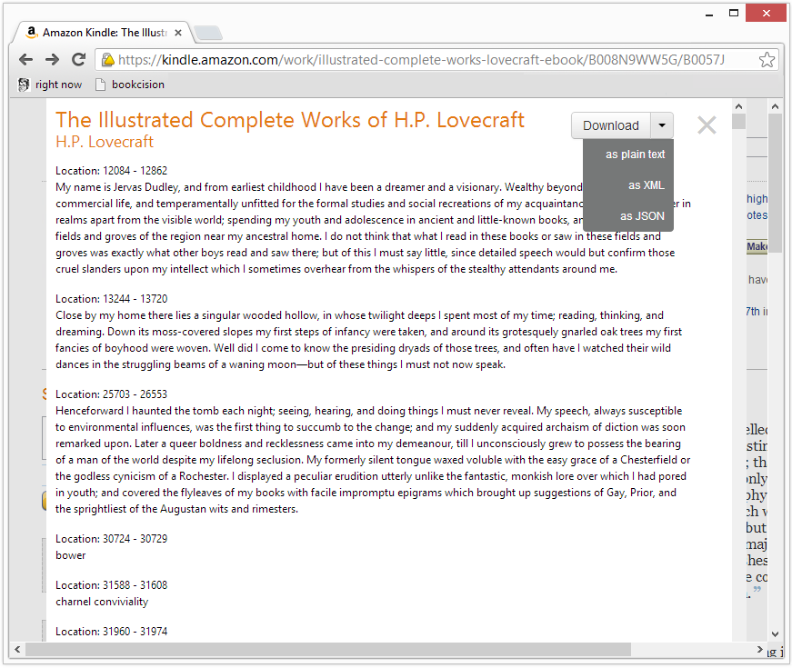
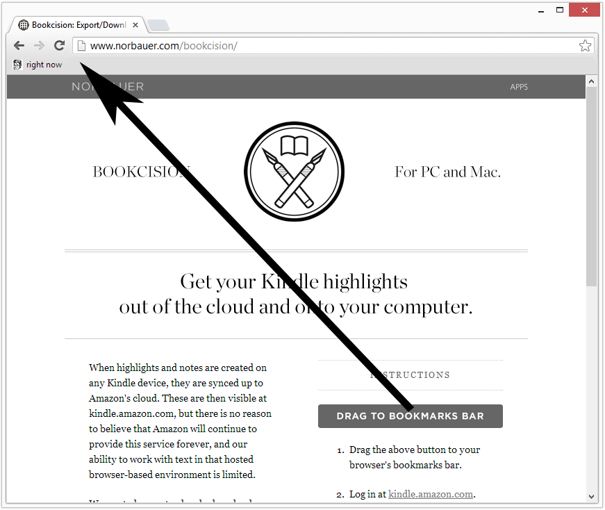
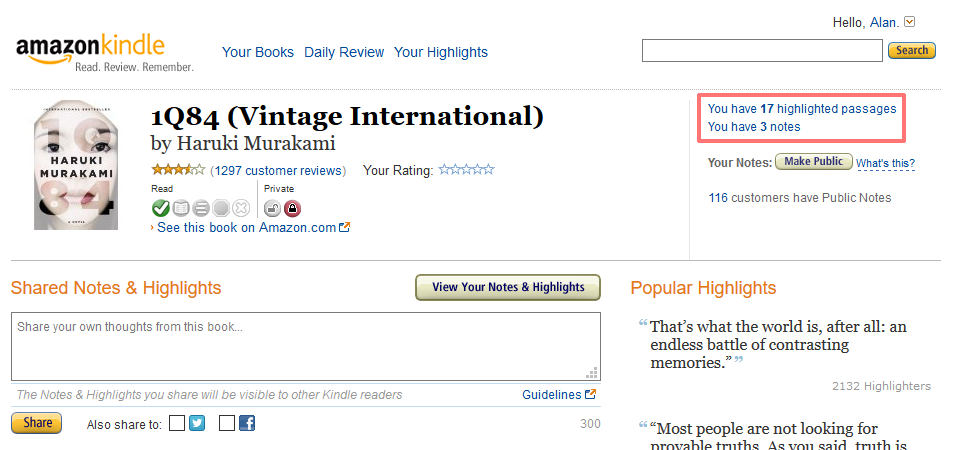
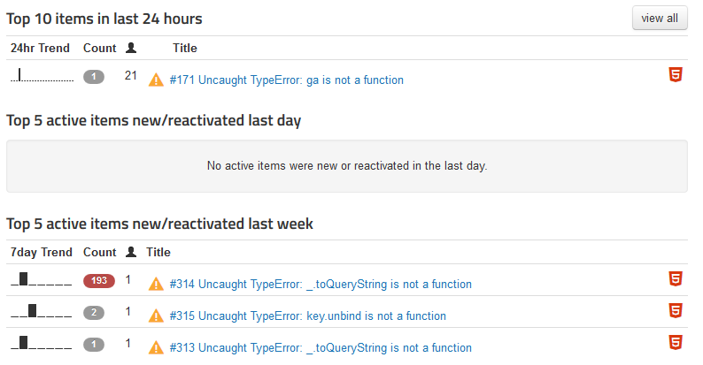
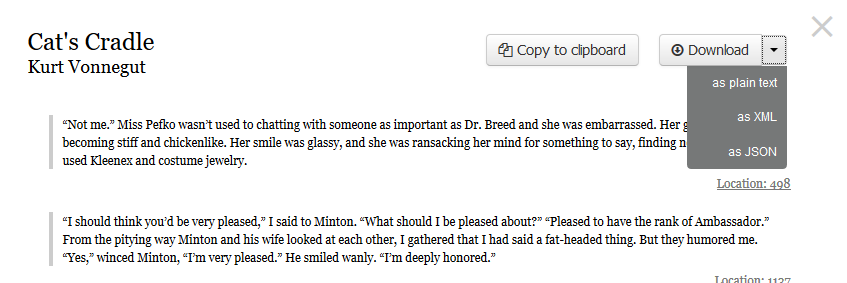

When I wrote the [Bookcision bookmarklet](http://www.norbauer.com/bookcision/) three years ago I was surprised by how much functionality you could stuff into a bookmarklet, and how much tooling existed to make it easier to build such a thing.

Bookcision is [open source](https://bitbucket.org/altano/bookcision/src) so feel free to follow along.



## What is Bookcision

When highlights are created on any Kindle device, they are synced up to Amazon's cloud. These are then visible at kindle.amazon.com. I wanted a way to cleanly download my highlights onto my local computer (for backup or whatever). Bookcision is a bookmarklet that can help you:

- Browse your Kindle notes & highlights in an easy-to-read format.
- Download your Kindle notes & highlights as JSON, XML, or plain-text.
- Copy-and-paste with the click of a button.

## Bookmarklet bootstrapping

### Clicking the bookmarklet

A bookmarklet is just a piece of JavaScript that you can execute on any website by clicking on a bookmark, usually created by someone other than the author of the website, with the intent of adding functionality. On the [Bookcision site](http://www.norbauer.com/bookcision/) there are instructions on how to install the bookmarklet. This entails dragging a large image to one's bookmark bar:


The image is wrapped in an anchor tag with the following href:

```html
javascript:(function%20(e){var%20t=document.createElement("script");t.setAttribute("src",e),t.setAttribute("crossorigin","anonymous"),document.body.appendChild(t)}('//norbauercdn.blob.core.windows.net/bookcision/latest/bookcision.js'));
```

This URL is what the browser navigates to when they click the newly-created bookmarklet. Where did that come from? Well, let's start with some a simple function which takes a URL to a script and adds it to the page:

```javascript
function addScript(codeURL) {
  var scriptElement = document.createElement("script");
  scriptElement.setAttribute("src", codeURL);
  scriptElement.setAttribute("crossorigin", "anonymous");
  document.body.appendChild(scriptElement);
}
```

The only interesting tidbit here is the not-yet-standardized "crossorigin" attribute on the script tag which was [recommended by Rollbar](https://rollbar.com/Rollbar/rollbar.js/items/134/solutions/)

Now we add some code to call this function with our bookmarklet JS URL (the bundle that is the output of our webpack build step):

```javascript
function addScript(codeURL) {
  var scriptElement = document.createElement("script");
  scriptElement.setAttribute("src", codeURL);
  scriptElement.setAttribute("crossorigin", "anonymous");
  document.body.appendChild(scriptElement);
}
addScript(
  "//norbauercdn.blob.core.windows.net/bookcision/latest/bookcision.js"
);
```

This can be minified to:

```javascript
(function (e) {
  var t = document.createElement("script");
  t.setAttribute("src", e),
    t.setAttribute("crossorigin", "anonymous"),
    document.body.appendChild(t);
})("//norbauercdn.blob.core.windows.net/bookcision/latest/bookcision.js");
```

To craft a URL that executes JS code, create a URL of the form:

```
javascript:<code>
```

Where `javascript` is the scheme and everything after the colon is URL-encoded JS code. In Bookcision, this all gets generated [with this code](https://bitbucket.org/altano/bookcision/src/07e78f60ae6cf326ea8f51cc8877998b200f794d/src/bookmarklet.js?at=default&fileviewer=file-view-default#bookmarklet.js-25).

If you put that all together, you get what we started with: the URL of the bookmarklet, the href of our anchor tag on the installation site:

```javascript
javascript:(function%20(e){var%20t=document.createElement("script");t.setAttribute("src",e),t.setAttribute("crossorigin","anonymous"),document.body.appendChild(t)}('//norbauercdn.blob.core.windows.net/bookcision/latest/bookcision.js'));
```

Now we have to take that link and embed it as an HTML href attribute in an &lt;a&gt; tag, so we'll need to HTML-encode it and we're done:

```html
<a
  id="bookmarklet"
  href='javascript:(function (e){var t=document.createElement("script");t.setAttribute("src",e),t.setAttribute("crossorigin","anonymous"),document.body.appendChild(t)}(&apos;//norbauercdn.blob.core.windows.net/bookcision/latest/bookcision.js&apos;));'
>
  
</a>
```

### Loading the bookmarklet JS bundle

When bookcision's JS bundle is executed, the code that gets executed is determined by what we configure the entry point to be in webpack:

[Gruntfile.js:75](https://bitbucket.org/altano/bookcision/src/07e78f60ae6cf326ea8f51cc8877998b200f794d/Gruntfile.js?at=tip&fileviewer=file-view-default#Gruntfile.js-75)

```Gruntfile.js
webpack: {
  options: {
  context: __dirname,
  entry: "./src/index.js",
```

[index.js](https://bitbucket.org/altano/bookcision/src/07e78f60ae6cf326ea8f51cc8877998b200f794d/src/index.js?at=tip&fileviewer=file-view-default#index.js-1) performs many functions:

- Check [minimum browser requirements](https://bitbucket.org/altano/bookcision/src/07e78f60ae6cf326ea8f51cc8877998b200f794d/src/index.js?at=tip&fileviewer=file-view-default#index.js-1)
- [Initializes Rollbar](https://bitbucket.org/altano/bookcision/src/07e78f60ae6cf326ea8f51cc8877998b200f794d/src/index.js?at=tip&fileviewer=file-view-default#index.js-10) for [unhandled exception telemetry](#error-reporting-with-rollbar)
- [One-time initialization](https://bitbucket.org/altano/bookcision/src/07e78f60ae6cf326ea8f51cc8877998b200f794d/src/index.js?at=tip&fileviewer=file-view-default#index.js-12) (only executes once, even if user clicks bookmarklet multiple times without reloading the host page). Uses a simple global variable to achieve this.
  - Initialize [polyfills](https://bitbucket.org/altano/bookcision/src/07e78f60ae6cf326ea8f51cc8877998b200f794d/src/index.js?at=tip&fileviewer=file-view-default#index.js-13) to make our lives easier
  - JSON.stringify bookcision's package.json contents and [store it in the user's localStorage](https://bitbucket.org/altano/bookcision/src/07e78f60ae6cf326ea8f51cc8877998b200f794d/src/index.js?at=tip&fileviewer=file-view-default#index.js-17). This might sound crazy but I figured it might be useful in the future to be able to do things like show release notes to the user when the version is updated.
- And finally, when the DOM is ready we kick off the core of the bookmarklet by [scraping the ASIN from the host page](https://bitbucket.org/altano/bookcision/src/07e78f60ae6cf326ea8f51cc8877998b200f794d/src/index.js?at=tip&fileviewer=file-view-default#index.js-73) and then [fetching the book info and registering a callback](https://bitbucket.org/altano/bookcision/src/07e78f60ae6cf326ea8f51cc8877998b200f794d/src/index.js?at=tip&fileviewer=file-view-default#index.js-78):

  ```javascript
  Book.get(asin, displayModalDialogForBook, failCallback);
  ```

## Embedding an HTML parser

The host page contains useful data embedded in the HTML and is easy to get at, e.g. the ASIN of the book the user is looking at. [The extraction code](https://bitbucket.org/altano/bookcision/src/07e78f60ae6cf326ea8f51cc8877998b200f794d/src/excisor/amazonScraper.js?at=default&fileviewer=file-view-default#amazonScraper.js-7) has fallbacks to deal with eventualities such as being in a different host environment (e.g. Amazon Cloud Reader) where the DOM might be different, but the data is still readily available.

The core data we're after, the user's highlights and notes for the book they are looking at, is a little more difficult to get. Initially we were using the same undocumented REST APIs that the page itself was using to populate the data, but Amazon changed these internal APIs frequently and there was a long stretch of time where they just didn't even work. The only reliable place I could find this data was on another HTML page, one Amazon even stopped linking to for many months (further vindicating the existence of Bookcision).



Since we're running in a browser, which is basically one big HTML-parser with an address bar, I could have loaded the page with the relevant HTML in a hidden iframe and then traversed the DOM to find the data. Everything was in the same origin (kindle.amazon.com) so that probably would have worked, but I had been itching for an excuse to play with an HTML parser. The thought of bundling a pure-JS HTML parser into the JS you run on a website is a strange concept, but one that turned out to work really well. I settled on using [htmlparser2](https://www.npmjs.com/package/htmlparser2) from npm, which could be webpacked into our bookmarklet and run in the browser just as well as it does natively in Node.js. Sound crazy? That's because it is.

So for a given ASIN, there is a page on the Amazon site that will contain the HTML for all the user's notes and highlights for that book. The format is:

`https://kindle.amazon.com/your_highlights_and_notes/<ASIN>`

e.g.

`https://kindle.amazon.com/your_highlights_and_notes/B003XRELGQ`

To get the notes and highlights:

1. Use [hyperquest](https://www.npmjs.com/package/hyperquest) to make an http request for the notes and highlights HTML page.
1. As the HTML is streaming back to the client, parse it using [htmlparser2](https://www.npmjs.com/package/htmlparser2).
1. Use [cornet](https://www.npmjs.com/package/cornet) to register event handlers on the streaming HTML parser. It takes a CSS selector and then emits events as DOM elements matching those selectors are parsed. This is abstracted away in [bookcision/src/lib/scrape.js](https://bitbucket.org/altano/bookcision/src/07e78f60ae6cf326ea8f51cc8877998b200f794d/src/lib/scrape.js?at=default&fileviewer=file-view-default):

   ```scrape.js
   function scrape(url, setupHook) {
     var cornet = new Cornet();

     if (setupHook) {
       setupHook(cornet);
     }

     var req = hyperquest.get(url);

     req.pipe(new Parser(cornet));

     req.on("response", function (res) {
       var status = res.statusCode;
       if (status < 200 || status >= 300) {
         var err = Error(
           "Received status code " +
             status +
             ' ("' +
             http.STATUS_CODES[status] +
             '")'
         );
         req.emit("error", err);
       }
     });

     req.on("error", function (err) {
       cornet.emit("error", err);
     });

     return cornet;
   }
   ```

1. Finally, we can use [cheerio](https://www.npmjs.com/package/cheerio) to have a jQuery-like syntax for easy inspection of those parsed elements, e.g.:
   `javascript var foundTitle = scraper.select("span.title a", function(titleLink) { title = $(titleLink).text().trim(); });`
   The code that handles all this can be found in [scrape.js](https://bitbucket.org/altano/bookcision/src/07e78f60ae6cf326ea8f51cc8877998b200f794d/src/lib/scrape.js?at=tip&fileviewer=file-view-default) and [BookScraper.js](https://bitbucket.org/altano/bookcision/src/07e78f60ae6cf326ea8f51cc8877998b200f794d/src/excisor/BookScraper.js?at=tip&fileviewer=file-view-default).

This method is neat in that it supports streaming. For really large collections of notes and highlights it might perform a lot faster than buffering the HTML before doing any parsing (e.g. waiting on the load event for the iframe), so let's just pretend that justifies the absurdity of this approach and move on.

## Testing

There is a [separate webpack config for test](https://bitbucket.org/altano/bookcision/src/07e78f60ae6cf326ea8f51cc8877998b200f794d/Gruntfile.js?at=default&fileviewer=file-view-default#Gruntfile.js-113) which allows us to generate a test-specific bundle with a [test-specific entry point](https://bitbucket.org/altano/bookcision/src/07e78f60ae6cf326ea8f51cc8877998b200f794d/test/index.js?at=tip&fileviewer=file-view-default). This is important because the test code all runs in Node.js and doesn't exercise any browser-specific UI code, so we need a different entry point that does call into any browser specific code (which is segregated in the source from the rest of the code).

The test code is a pretty straightforward [mocha](https://www.npmjs.com/package/mocha)+[sinon](https://www.npmjs.com/package/sinon)+[should](https://www.npmjs.com/package/should) setup. Getting sinon to work with webpack can _still_ be painful but you can get help in [this github issue](https://github.com/webpack/webpack/issues/177). Getting sinon to mock/intercept XMLHttpRequests is unbearably difficult and I don't recommend it, but I found [mitm](https://www.npmjs.com/package/mitm) to provide a much cleaner way of doing this instead. The http interception code captures XmlHttpRequests, returns hard-coded JSON files, and is dead simple:

[httpInterception.js](https://bitbucket.org/altano/bookcision/src/07e78f60ae6cf326ea8f51cc8877998b200f794d/test/httpInterception.js?at=tip&fileviewer=file-view-default):

```httpInterception.js
mitm.on("request", function(req, res) {
  var highlightsFile;
  var shouldSucceed = true;

  if (req.url === "/fb55") {
    highlightsFile = "test/data/fb55.html";
  }
  else {
    ...
  }

  res.statusCode = shouldSucceed ? 200 : 500;

  // Send contents of highlights file as response
  if (shouldSucceed && highlightsFile) {
    var htmlStream = fs.createReadStream(highlightsFile);
    htmlStream.pipe(res);
  }
  else {
    res.end("No highlights. =[");
  }
});
```

XMLHttpRequest isn't natively available in Node.js but there are many [shims](https://www.npmjs.com/package/xmlhttprequest) you can make use of so that your code runs in Node.js just as it would in the browser.

## Embedding analytics

By [bundling Google Analytics](https://bitbucket.org/altano/bookcision/src/07e78f60ae6cf326ea8f51cc8877998b200f794d/src/vendor/googleAnalytics.js?at=default&fileviewer=file-view-default), I can get useful information about my users. I don't really make heavy use of this but I liked the idea of doing this in a bookmarklet and having the info available should I ever want it.

## Error Reporting with Rollbar

You should never ship code to users without having a way of getting telemetry about what errors they are hitting. For this I'm utilizing the excellent [Rollbar service](https://rollbar.com/) to capture any unhandled exceptions. Relevant code [here](https://bitbucket.org/altano/bookcision/src/07e78f60ae6cf326ea8f51cc8877998b200f794d/src/lib/rollbar.js?at=default&fileviewer=file-view-default). Rollbar wasn't very webpack friendly back then but their team was responsive and made a version that was, so thanks to them for getting that done for me.

Bookcision's Rollbar dashboard


There's some noise to contend with since Rollbar will capture exceptions from any JS code on the page once the user initiates the bookmarklet, not just ones generated by the bookmarklet's code, but this hasn't been an issue.

The integration was dead simple. The hardest part was creating [the deploy step](#deploying-to-azure) to push the JS source created by webpack at build time to Rollbar. By pre-emptively pushing the source maps to Rollbar everytime you release a new version of your code, the first time a user hits an exception in your code, Rollbar will already have the source map and will be able to generate a clean stack trace that reflects your source code before webpack bundling. I normally am not an advocate of using source maps since they usually do little else than make debugging impossible, but this is an excellent use of them.

## Exporting files for download

With Bookcision you can download your notes and highlights as a file in plain-text, JSON, or XML.



This would be easy to achieve if there were a server component: the server would download the notes and highlights for the user and serve them up as a file that I could link to. With a content-disposition of "attachment", the user would be prompted to save the file, and we'd be done.

But, since we're just running a bookmarklet and there is no web application running on a server, we have to make use of the excellent [FileSaver.js](https://github.com/eligrey/FileSaver.js/) library which allows you to take a string of text (e.g. all the text from the notes and highlights) and prompt the user to save it as a file. I was surprised these browser APIs existed.

## Deploying to Azure

Since Bookcision is deployed as just a single JS file, deployment essentially entails pushing that JS file to a CDN.

### Deploying from the command line

1. The [azureblob](https://www.npmjs.com/package/grunt-azureblob) grunt plugin is [used in a task](https://bitbucket.org/altano/bookcision/src/07e78f60ae6cf326ea8f51cc8877998b200f794d/Gruntfile.js?at=default&fileviewer=file-view-default#Gruntfile.js-268) to deploy the resulting JS bundle to Azure CDN. It deploys each new version without overwriting the last, and points the "latest" folder to the new version. This theoretically allows for easy rollback in the case of some problem.
1. Source maps, as generated by webpack, [are uploaded to Rollbar](https://bitbucket.org/altano/bookcision/src/07e78f60ae6cf326ea8f51cc8877998b200f794d/Gruntfile.js?at=default&fileviewer=file-view-default#Gruntfile.js-298) on every deploy to allow for more useful callstacks in their error reports.
1. It is critical that [everything be uglified/minified](https://bitbucket.org/altano/bookcision/src/07e78f60ae6cf326ea8f51cc8877998b200f794d/Gruntfile.js?at=default&fileviewer=file-view-default#Gruntfile.js-224) given the shear amount of libraries I stuffed into this thing. The bookmarklet JS bundle is 1MB before minification and 367KB after.

### Why Azure

Your first question might be, "why Azure and not the more popular Amazon," and the answer to that isn't that I work for Microsoft, it is that I couldn't get CORS to work on Amazon S3/CDN, no one on the AWS forums provided help getting it to work, and it worked perfectly on Azure on my first try.

## The less interesting bits

The less interesting technology that I used that I won't go into detail about:

- Gruntfile - Gulp didn't even exist when I started this project. Nothing interesting here, pretty [standard Gruntfile](https://bitbucket.org/altano/bookcision/src/07e78f60ae6cf326ea8f51cc8877998b200f794d/Gruntfile.js?fileviewer=file-view-default).
- Webpack for bundling - 2013 is so long ago on the web that back then [webpack](https://webpack.github.io/) had most of its documentation in an HTML slideshow. One feature that initially struck me as pointless was being able to move your CSS into your JS bundle, but as I read more about webpack, I realized its power was not in being the best JS bundler at the time or allowing you to utilize [npm](https://www.npmjs.com/) modules in your browser code, but rather in allowing you to explicitly declare the dependencies between all your resources, including non-JS ones. BUT, being able to bundle _all_ of the non-JS resources into a single JS file is obviously really useful for a bookmarklet, since you preferably only want to bootstrap a single file. Which leads me to...
- Code forking (e.g. DEBUG-only code) - There are [many](https://bitbucket.org/altano/bookcision/src/07e78f60ae6cf326ea8f51cc8877998b200f794d/src/index.js?at=tip&fileviewer=file-view-default#index.js-63) [places](https://bitbucket.org/altano/bookcision/src/07e78f60ae6cf326ea8f51cc8877998b200f794d/src/lib/rollbar.js?at=tip&fileviewer=file-view-default#rollbar.js-3) where the code forks based on whether or not we're in DEBUG/TEST mode. [My code achieves this](https://bitbucket.org/altano/bookcision/src/07e78f60ae6cf326ea8f51cc8877998b200f794d/Gruntfile.js?at=default&fileviewer=file-view-default#Gruntfile.js-155) using [webpack's DefinePlugin](https://webpack.github.io/docs/list-of-plugins.html#defineplugin).
  ```javascript
  if (DEBUG) {
    var noop = function () {};
    rollbar = { critical:noop, error:noop, warning:noop, info:noop, debug:noop };
  }
  else {
    ...
  }
  ```
- Home-rolled UI templating - We render the notes and highlights into many formats: HTML for rendering right onto the page as well as plain-text, XML, and JSON for the user to download. I wanted to experiment with rolling my own UI templating for the HTML b/c I wanted to play with completely logic-less templates. This is achieved by splitting the templates into two parts:
  1. A pure-HTML (or in this case, [Jade](http://jade-lang.com/)) template, e.g. [book.jade](https://bitbucket.org/altano/bookcision/src/07e78f60ae6cf326ea8f51cc8877998b200f794d/src/excisor/templates/book.jade?at=default&fileviewer=file-view-default)
  1. And [glue code](https://bitbucket.org/altano/bookcision/src/07e78f60ae6cf326ea8f51cc8877998b200f794d/src/excisor/templates/book.jade.js?at=default&fileviewer=file-view-default) that uses CSS selectors to map HTML to event handlers or any other code that needs logic.
  ```javascript
  module.exports = templateEnhancer(bookHtmlTemplate, {
    events: [
      {
        selector: ".bookcision-download-as-text",
        event: "click",
        handler: function(book, event) { downloadBook(book, "text"); }
      },
      ...
  ```

## What I would do differently

If I were to write this today rather than in 2013, I would:

- Use more [ES6](http://www.2ality.com/2015/08/getting-started-es6.html), [TypeScript](http://www.typescriptlang.org/), and [Promises](https://developer.mozilla.org/en-US/docs/Web/JavaScript/Reference/Global_Objects/Promise).
- I would just use an existing view library for templating OR write a templating language from scratch. I didn't find the middle ground I took to be informative.
- Research using [Shadow DOM](http://www.html5rocks.com/en/tutorials/webcomponents/shadowdom/) (not to be confused with [React's](https://facebook.github.io/react/) virtual DOM). A third-party bookmarklet that renders UI on another site is a _perfect_ fit for Shadow DOM, although [browser support is still iffy](http://www.html5rocks.com/en/tutorials/webcomponents/shadowdom/).
- Not use [ZeroClipboard](https://github.com/zeroclipboard/zeroclipboard) for the [copy-to-clipboard feature](https://bitbucket.org/altano/bookcision/src/07e78f60ae6cf326ea8f51cc8877998b200f794d/src/lib/ui/components/ClipboardButton.js?at=default&fileviewer=file-view-default). It uses flash under the covers and that isn't exactly future-proof.

Feel free to look through [the rest of the source](https://bitbucket.org/altano/bookcision/src) where I'm sure you can find tons of other crazy things. This was a fun project and I'm happy with the result.
