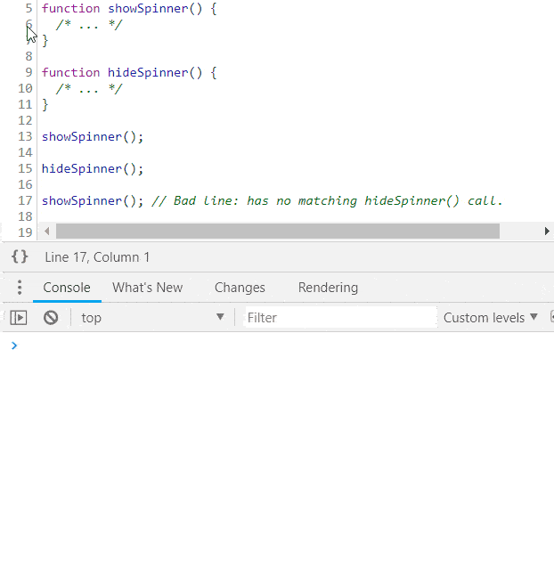
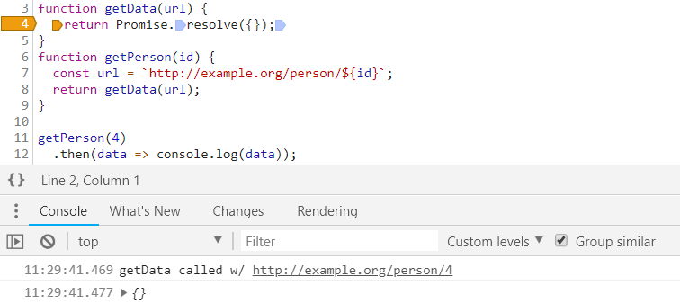

A list of useful, not-obvious hacks to get the most out of your browser's[^1] debugger. Assumes an intermediate-level-or-higher understanding of the developer tools.

[^1]: Tips are supported in Chrome, Firefox, and Edge unless the browser logos say otherwise: <Chrome /> <Firefox /> <Edge />

## Advanced Conditional Breakpoints

By using expressions that have side effects in places you wouldn't expect, we can squeeze more functionality out of basic features like conditional breakpoints.

### Logpoints / Tracepoints

For example, we can `console.log` in breakpoints. Logpoints are breakpoints that log to the console without pausing execution. While Microsoft Edge has had logpoints built-in for a while and Chrome just added them in v73, Firefox does not. But, we can use conditional breakpoints to simulate them in any browser.


Use `console.count` instead of `console.log` if you also want a running count of how many times the line is executed.

UPDATE (May 2020): All the major browsers now directly support logpoints/tracepoints (<a href="https://developers.google.com/web/updates/2019/01/devtools#logpoints" alt="Chrome Logpoints Documentation">Chrome Logpoints</a>, <a href="https://docs.microsoft.com/en-us/microsoft-edge/devtools-guide/debugger#breakpoints" alt="Edge Tracepoint Documentation">Edge Tracepoints</a>, <a href="https://developer.mozilla.org/en-US/docs/Tools/Debugger/Set_a_logpoint" alt="Firefox Logpoint Documentation">Firefox Logpoints</a>)

#### Watch Pane

You can also use `console.log` in the watch pane. For example, to dump a snapshot of `localStorage` everytime your application pauses in the debugger, you can create a `console.table(localStorage)` watch:


Or to execute an expression after DOM mutation, set a DOM mutation breakpoint (in the Element Inspector):


And then add your watch expression, e.g. to record a snapshot of the DOM: `(window.doms = window.doms || []).push(document.documentElement.outerHTML)`. Now, after any DOM subtree modification, the debugger will pause execution and the new DOM snapshot will be at the end of the `window.doms` array. (There is no way to create a DOM mutation breakpoint that doesn't pause execution.)

#### Tracing Callstacks

Let's say you have a function that shows a loading spinner and a function that hides it, but somewhere in your code you're calling the show method without a matching hide call. How can you find the source of the unpaired show call? Use `console.trace` in a conditional breakpoint in the show method, run your code, find the last stack trace for the show method and click the caller to go to the code:



### Changing Program Behavior

By using expressions that have side effects on program behavior, we can change program behavior on the fly, right in the browser.

For example, you can override the param to the `getPerson` function, `id`. Since `id=1` evaluates to true, this conditional breakpoint would pause the debugger. To prevent that, append `, false` to the expression.



### Quick and Dirty Performance Profiling

You shouldn't muddy your performance profiling with things like conditional breakpoint evaluation time, but if you want a quick and dirty measurement of how long something takes to run, you can use the console timing API in conditional breakpoints. In your starting point set a breakpoint with the condition `console.time('label')` and at the end point set a breakpoint with the condition `console.timeEnd('label')`. Everytime the thing you're measuring runs, the browser will log to the console how long it takes.


### Using Function Arity

#### Break on Number of Arguments

Only pause when the current function is called with 3 arguments: `arguments.callee.length === 3`

Useful when you have an overloaded function that has optional parameters.


#### Break on Function Arity Mismatch

Only pause when the current function is called with the wrong number of arguments: `(arguments.callee.length) != arguments.length`


Useful when finding bugs in function call sites.

### Using Time

#### Skip Page Load

Don't pause until 5 seconds after page load:
`performance.now() > 5000`

Useful when you want to set a breakpoint but you're only interested in pausing execution after initial page load.

#### Skip N Seconds

Don't pause execution if the breakpoint is hit in the next 5 seconds, but pause anytime after: `window.baseline = window.baseline || Date.now(), (Date.now() - window.baseline) > 5000`

Reset the counter from the console anytime you'd like: `window.baseline = Date.now()`

### Using CSS

Pause based on computed CSS values, e.g. only pause execution when the document body has a red background color: `window.getComputedStyle(document.body).backgroundColor === "rgb(255,0,0)"`

### Even Calls Only

Only pause every other time the line is executed:
`window.counter = window.counter || 0, window.counter % 2 === 0`

### Break on Sample

Only break on a random sample of executions of the line, e.g. only break 1 out of every 10 times the line is executed:
`Math.random() < 0.1`

### Never Pause Here

<Chrome />

When you right-click the gutter and select "Never Pause Here," Chrome creates a conditional breakpoint that is `false` and never passes. This makes it so that the debugger will never pause on this line.


Useful when you want to exempt a line from XHR breakpoints, ignore an exception that is being thrown, etc.

### Automatic Instance IDs

Automatically assign a unique ID to every instance of a class by setting this conditional breakpoint in the constructor: `(window.instances = window.instances || []).push(this)`

Then to retrieve the unique ID: `window.instances.indexOf(instance)` (e.g. `window.instances.indexOf(this)` when in a class method)

### Programmatically Toggle

Use a global boolean to gate one or more conditional breakpoints:


Then programmatically toggle the boolean, e.g.

- manually, from the console
  ```javascript
  window.enableBreakpoints = true;
  ```
- from other breakpoints
  
- from a timer on the console
  ```javascript
  setTimeout(() => (window.enableBreakpoints = true), 5000);
  ```
- etc

## monitor() class Calls

<Chrome />

You can use Chrome's `monitor` command line method to easily trace all calls to class methods. E.g. given a class `Dog`

```javascript
class Dog {
  bark(count) {
    /* ... */
  }
}
```

If we want to know all calls made to all instances of `Dog`, paste this into the command line:

```javascript
var p = Dog.prototype;
Object.getOwnPropertyNames(p).forEach((k) => monitor(p[k]));
```

and you'll get output in the console:

```
> function bark called with arguments: 2
```

You can use `debug` instead of `monitor` if you want to pause execution on any method calls (instead of just logging to the console).

### From a Specific Instance

<Chrome />

If you don't know the class but you have an instance:

```javascript
var p = instance.constructor.prototype;
Object.getOwnPropertyNames(p).forEach((k) => monitor(p[k]));
```

Useful when you'd like to write a function that does this for any instance of any class (instead of just `Dog`)

## Call and Debug a Function

Before calling the function you want to debug in the console, call `debugger`. E.g. given:

```javascript
function fn() {
  /* ... */
}
```

From your console:

```
> debugger; fn(1);
```

And then "Step into next function call" to debug the implementation of `fn`.

Useful when you don't feel like finding the definition of `fn` and adding a breakpoint manually or if `fn` is dynamically bound to a function and you don't know where the source is.

In Chrome you can also optionally call `debug(fn)` on the command line and the debugger will pause execution inside `fn` every time it is called.

## Pause Execution on URL Change

To pause execution before a single-page application modifies the URL (i.e. some routing event happens):

```javascript
const dbg = () => {
  debugger;
};
history.pushState = dbg;
history.replaceState = dbg;
window.onhashchange = dbg;
window.onpopstate = dbg;
```

Creating a version of `dbg` that pauses execution without breaking navigation is an exercise left up to the reader.

Also, note that this doesn't handle when code calls `window.location.replace/assign` directly because the page will immediately unload after the assignment, so there is nothing to debug. If you still want to see the source of these redirects (and debug your state at the time of redirect), in Chrome you can `debug` the relevant methods:

```javascript
debug(window.location.replace);
debug(window.location.assign);
```

## Debugging Property Reads

If you have an oject and want to know whenever a property is read on it, use an object getter with a `debugger` call. For example, convert `{configOption: true}` to `{get configOption() { debugger; return true; }}` (either in the original source code or using a conditional breakpoint).

Useful when you're passing in some configuration options to something and you'd like to see how they get used.

## Use copy()

<Chrome /> <Firefox />

You can copy interest information out of the browser directly to your clipboard without any string truncation using the `copy()` console API. Some interesting things you might want to copy:

- Snapshot of the current DOM: `copy(document.documentElement.outerHTML)`
- Metadata about resources (e.g. images): `copy(performance.getEntriesByType("resource"))`
- A large JSON blob, formatted: `copy(JSON.parse(blob))`
- A dump of your localStorage: `copy(localStorage)`
- Etc.

## Debugging HTML/CSS

The JS console can be helpful when diagnosing problems with your HTML/CSS.

### Inspect the DOM with JS Disabled

When in the DOM inspector press ctrl+\ (Chrome/Windows) to pause JS execution at any time. This allows you to inspect a snapshot of the DOM without worrying about JS mutating the DOM or events (e.g. mouseover) causing the DOM to change from underneath you.

### Inspect an Elusive Element

Let's say you want to inspect a DOM element that only conditionally appears. Inspecting said element requires moving your mouse to it, but when you try to, it disappears:


To inspect the element you can paste this into your console: `setTimeout(function() { debugger; }, 5000);`. This gives you 5 seconds to trigger the UI, and then once the 5 second timer is up, JS execution will pause and nothing will make your element disappear. You are free to move your mouse to the dev tools without losing the element:


While JS execution is paused you can inspect the element, edit its CSS, execute commands in the JS console, etc.

Useful when inspecting DOM that is dependent on specific cursor position, focus, etc.

### Record Snapshots of the DOM

To grab a copy of the DOM in its current state:

```javascript
copy(document.documentElement.outerHTML);
```

To record a snapshot of the DOM every second:

```javascript
doms = [];
setInterval(() => {
  const domStr = document.documentElement.outerHTML;
  doms.push(domStr);
}, 1000);
```

Or just dump it to the console:

```javascript
setInterval(() => {
  const domStr = document.documentElement.outerHTML;
  console.log("snapshotting DOM: ", domStr);
}, 1000);
```

### Monitor Focused Elemnt

```javascript
(function () {
  let last = document.activeElement;
  setInterval(() => {
    if (document.activeElement !== last) {
      last = document.activeElement;
      console.log("Focus changed to: ", last);
    }
  }, 100);
})();
```


### Find Bold Elements

```javascript
const isBold = (e) => {
  let w = window.getComputedStyle(e).fontWeight;
  return w === "bold" || w === "700";
};
Array.from(document.querySelectorAll("*")).filter(isBold);
```

#### Just Descendants

Or just descendants of the element currently selected in the inspector:

```javascript
Array.from($0.querySelectorAll("*")).filter(isBold);
```

### Reference Currently Selected Element

`$0` in the console is an automatic reference to the currently selected element in the element inspector.

#### Previous Elements

<Chrome /> <Edge />

In Chrome and Edge you can access the element you last inspected with `$1`, the element before that with `$2`, etc.

#### Get Event Listeners

<Chrome />

In Chrome you can inspect the event listeners of the currently selected element: `getEventListeners($0)`, e.g.


### Monitor Events for Element

<Chrome />

Debug all events for selected element: `monitorEvents($0)`

Debug specific events for selected element: `monitorEvents($0, ["control", "key"])`


