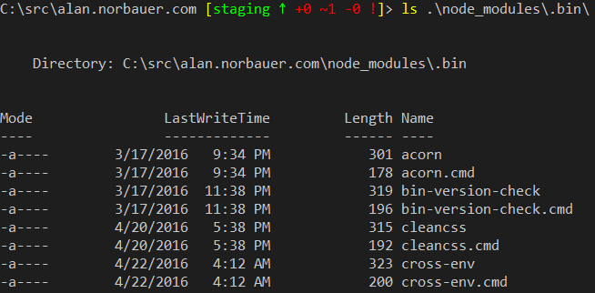
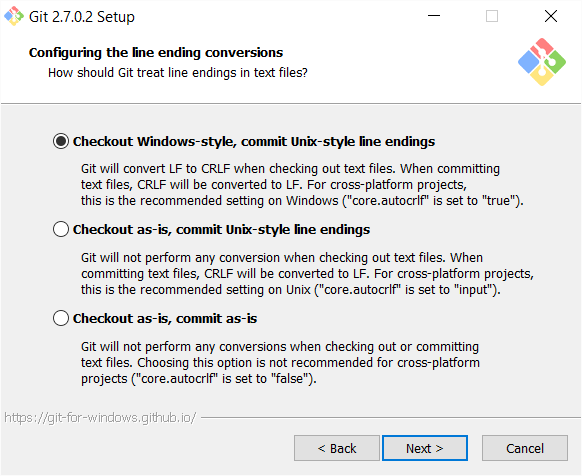

An on-going guide to help you write better cross-platform Node.js.

Since most Node.js users are running OS X or Linux, "cross-platform" means "works with Windows too." Fortunately, almost everything does: Node.js and the whole ecosystem are super Windows friendly. Unlike other, even-more-homogenous ecosystems like Ruby's, in the three years I've been playing with Node.js I've only had trouble running Windows a handful of times. So here are some problems you might hit and solutions for dealing with them.

## Paths

Avoid 99% of path-related issues by following two rules:

1. Do not use paths and URLs interchangeably[^1]

[^1]: This site is built using the static site generator [Metalsmith](http://www.metalsmith.io/), which is really fantastic in its simplicity. Unfortunately, a lot of the plugins do things like assume that you can use a relative file path, e.g. "subdirectory/file.txt," as an anchor's href. Except that on Windows you're now generating URLs with backslashes in them. Gross.

1. When modifying, creating, or parsing a path, use Node's built-in [path APIs](https://nodejs.org/api/path.html) instead of string manipulation.

[Domenic Denicola](https://domenic.me) has some good advice [here](https://gist.github.com/domenic/2790533#paths-and-urls).

### Hard-coding executable paths

It's fine to hard-code relative paths to an executable if you're careful and you:

1. Don't hard-code more than you need to. The `./node_modules/.bin` folder is automatically added to your shell's path when running an npm script, so use:

```json
{
  "scripts": {
    "test": "mocha"
  }
}
```

instead of

```json
{
  "scripts": {
    "test": "./node_modules/.bin/mocha"
  }
}
```

1. Make sure the path is something any shell can understand. If your path is to a bash shell script it obviously won't work on Windows. This is why node modules have a ".cmd" version of executables side-by-side with a bash script. Each shell will do the right thing.
   
1. Don't leak the hard-coded path as data. If the path will ever be passed to another module, returned to the user, etc, then use the Node.js path APIs to build it instead so that the path conforms to what a path should look like on that platform.
1. And if you're a Windows dev, use forward slashes. They'll work everywhere while backslashes won't.

### upath as a path replacement

The [upath](https://www.npmjs.com/package/upath) package is a drop-in replacement for path that makes all paths returned by the API have forward slashes instead of backslashes (among other things). I wouldn't recommend using this library regularly but I've used it to quickly fix some Metalsmith plugins that were treating paths as URLs. Switching to this library was an extremely small and easy one-line fix I could make to these plugins that fixed all the downstream code.

## Scripts in package.json

I don't want to deal with the complexity of [grunt](http://gruntjs.com/) and [gulp](http://gulpjs.com/) when I'm only performing simple tasks, so using the [package.json "scripts" section](https://docs.npmjs.com/cli/run-script) as a simple task runner is appealing[^2]. For example, the package.json[^3] for this site is:

[^2]: See ["Running scripts with npm"](https://www.jayway.com/2014/03/28/running-scripts-with-npm/) and ["How to Use npm as a Build Tool"](http://blog.keithcirkel.co.uk/how-to-use-npm-as-a-build-tool/)

[^3]: Don't ask why I have a staging environment for such a simple site. I guess I was having fun experimenting with Azure's [deployment slots](https://azure.microsoft.com/en-us/documentation/articles/web-sites-staged-publishing/).

```json
{
  "scripts": {
    "start": "npm run watch",
    "watch": "node ./bin/watch.js",
    "build:staging": "cross-env NODE_ENV=development node ./bin/build.js",
    "build:staging:debug": "cross-env DEBUG=cdnify npm run build:staging",
    "build:production": "cross-env NODE_ENV=production node ./bin/build.js",
    "build": "npm-run-all build:*"
  }
}
```

Task runners abstract away platform incompatibilities from you while npm scripts will run your scripts as shell commands, verbatim[^4]. You can avoid any issues by writing as little shell code as possible and deferring to Node.js scripts instead. Some common pitfalls and ways to avoid them:

[^4]: ["Commands are passed verbatim to either cmd or sh." --isaacs](https://github.com/npm/npm/issues/4040#issuecomment-27159695)

### Running multiple scripts

Most suggest using `&&` to run multiple commands which works in Bash and cmd.exe[^5]. Good advice, but I prefer [npm-run-all](https://www.npmjs.com/package/npm-run-all). It abstracts shell syntax, gives you the ability to run wildcards, and by default will bail out when a command fails. It's as simple as this:

[^5]: npm will use cmd.exe to run the script, even if you're in a PowerShell prompt, which is probably a good idea.

1. `npm i npm-run-all --save-dev`
1. `"scripts": {"build": "npm-run-all build test"}`

### Shell scripts that rely on Unix shebangs

cmd.exe/PowerShell don't understand [shebangs](https://en.wikipedia.org/wiki/Shebang_%28Unix%29). Call scripts using node.exe explicitly:

```json
{
  "scripts": {
    "watch": "node ./bin/watch.js"
  }
}
```

instead of

```json
{
  "scripts": {
    "watch": "./bin/watch.js"
  }
}
```

### Setting one-off environment variables

In bash you can run a command with an environment variable set without changing the environment variable in the shell:

```bash
NODE_ENV=production webpack
```

The closest you can get with cmd.exe is:

```powershell
set NODE_ENV=production; webpack
```

But now your shell has NODE_ENV=production set for all future scripts you run. This is easily fixed by using [cross-env](https://www.npmjs.com/package/cross-env), e.g.:

```json
{
  "scripts": {
    "build": "cross-env NODE_ENV=production webpack"
  }
}
```

This runs webpack with the production NODE_ENV and doesn't dirty your shell session.

## Line-endings in test fixtures

The default option in [Git for Windows](https://git-scm.com/download/win) is to set the git config option [`core.autocrlf`](https://git-scm.com/book/en/v2/Customizing-Git-Git-Configuration#Formatting-and-Whitespace) to `true`.



I've seen this be an issue multiple times with test fixtures. The output of some module will only contain line-feed characters and it is compared to the contents of a file on disk. If that file was created by git on a Windows machine, it'll have crlf newlines instead of just lf and the test will fail, e.g.:

```js
assert("Hello world!\r\n" === "Hello world!\n");
```

The fix is easy: add a .gitattributes file to your git repository with something like this:

```ini
test/fixtures/**    text eol=lf
```

This will make the line endings for all files in the test/fixtures directory (and subdirectories) be line-feed characters regardless of platform. I don't recommend turning this on for your whole repository, or worse, disabling git's core.autocrlf option, which would both cause more headaches than they would avoid.

GitHub has [some good instructions](https://help.github.com/articles/dealing-with-line-endings/#refreshing-a-repository-after-changing-line-endings) on how to refresh your already-cloned repository to reflect the changes to the .gitattributes if you're applying this fix after-the-fact.
