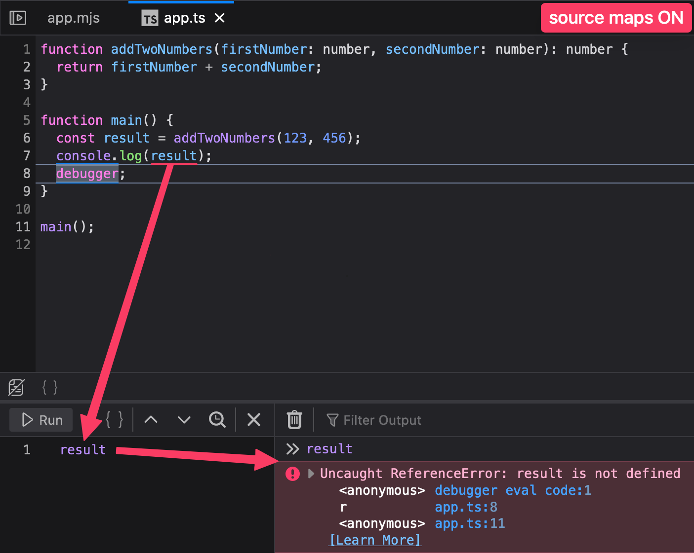
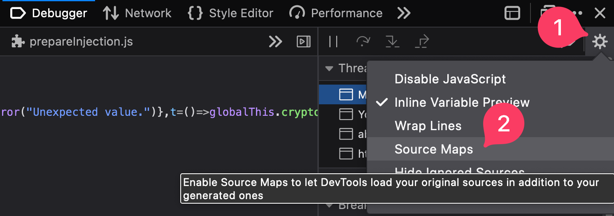

import pkg from "@root/package.json";

Anytime you open the Chrome or Firefox dev tools to debug JavaScript code, you should disable JavaScript source maps. This is the first thing I do when I open developer tools on a new machine.

## Why You Should Disable Them

[This comment on Hacker News](https://news.ycombinator.com/item?id=38227682) explains the problem:

> I can never get watched variables to work. The scoping and updating rules for it are a mystery to me. I assume only global variables can be watched, but even then it never works as I expect, so I end up just flooding the log with values when testing. -[russellbeattie](https://news.ycombinator.com/user?id=russellbeattie)

JavaScript source maps are good at exactly on thing: passively reading minified/compiled JavaScript source code / call stacks. Counterintuitively, if you are _in any way_ interacting with source code in the debugger, you will have a _much_ better experience disabling JavaScript source maps.

### Examples

To demonstrate the problem, let's view the same source code in the debugger, both with and without source maps, and see what works and what doesn't.

#### Source Maps OFF

With source maps off, we are able to hover an expression and see it's value. Note that we can add the expression to the "Watch expressions" pane and the value is correctly rendered:

✅ Tooltips work
✅ Watch expressions work

With source maps off, we are able to use the expression `n` (as seen in the source) in the JS console:

✅ Using expressions in console works

#### Source Maps ON

With source maps on, we are no longer able to hover an expression and see it's value. Adding the expression to the "Watch expressions" pane also doesn't work:

❌ Tooltips are broken
❌ Watch expressions are broken

With source maps on, we are no longer able to use the expression `result` (as seen in the source) in the JS console:

❌ Using expressions in console is broken

## How to Disable Them

### Chrome <Chrome />

The easiest and fastest way to toggle CSS or JS source maps in the Chrome developer tools is to use Chrome's command palette:

1. On macOS type cmd+shift+p (on Windows type ctrl+shift+p)
1. Search for "source map"
1. Select enable/disable for CSS or JS source maps, whichever you want to toggle:
   

### Firefox <Firefox />

There is no similar shortcut for Firefox[^feature-request] but you can toggle source maps on/off from the developer tools settings. Note that you might need to refresh the page for the change to take effect. I believe this toggles both JS and CSS source maps (<a href={`mailto:${pkg.author.email}?subject=Firefox%20Source%20Maps`}>e-mail me</a> if you know for sure):

As an alternative, you can disable source maps right from the debugger without going into the settings:

## Why is This a Thing?

I'm pretty sure **source maps should not be enabled by default in developer tool debuggers**. Browsers break many critical features of their debuggers, by default, as soon as source maps are available, and break them in a way that is totally not obvious to the developer (since rendering `undefined` in a tooltip might just make it seem like the value really is `undefined`).

As for improving how source maps affect the experience of debugging: there is [a source map RFC](https://github.com/tc39/source-map-rfc/issues/12) at TC-39 to improve "post-hoc debuggability" with Source Maps v4.

[^feature-request]: It's been requested: https://github.com/firefox-devtools/ux/issues/101
