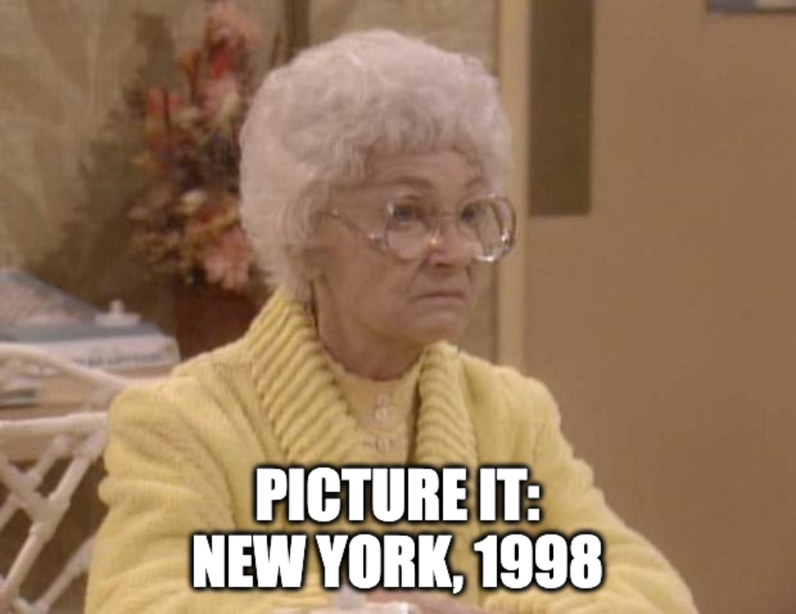
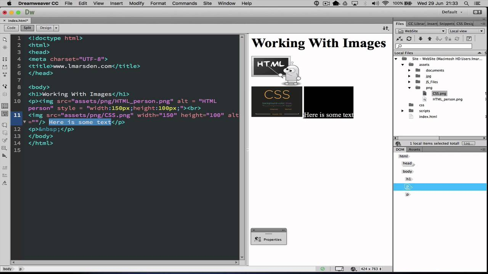
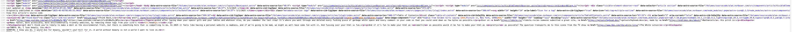
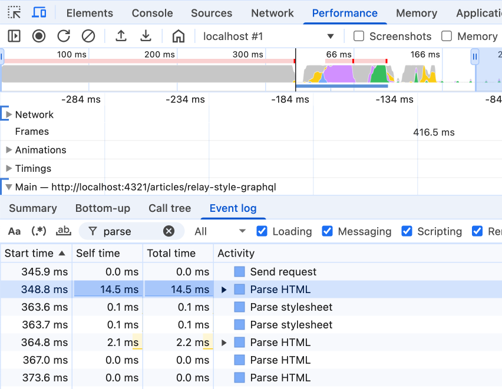

import sophia from "./sophia.jpeg";
import relayBefore from "./relay-before.png";
import relayAfter from "./relay-after.png";
import htmlPrettier from "./html-prettier.png";
import htmlChrome from "./html-chrome-pretty-print.png";
import ImageComparison from "@/components/image/ImageComparison.astro";

## Picture It

Sometimes I think back to how I got started writing html.



I open HomeSite, ready to write some html by hand like a madman:

<figure>
  
  <figcaption>
    Screenshot of HomeSite, credit
    [homesite.neocities.org](https://homesite.neocities.org)
  </figcaption>
</figure>

Or, if it's more relatable, pretend it's 2005 and I'm opening Dreamweaver:

<figure>
  
  <figcaption>
    Screenshot of Dreamweaver, credit Leon Marsden,
    [YouTube](https://www.youtube.com/watch?v=B100uPa_NPo)
  </figcaption>
</figure>

And after laying down my spacer gifs and my tables and whatever else, I would minify it by going through and deleting every piece of garbage white space and every comment in the code so that I could send down as few bytes as possible and make it look like this:



Oh no wait I absolutely didn't do that because why would I. I don't even know when the word "minify" entered my lexicon but it certainly wasn't with me back then. Which is ironic, because that's when we would have benefited from it the most.

Nowadays we just treat internet bandwidth as a game where the person who sends the most JS wins. As long as it's minified! When did that start happening?

## What Got Me Thinking

Over on [lobste.rs](https://lobste.rs/s/hnqkhk/remove_these_tags_from_head) someone submitted a great site, [getoutofmyhead.dev](https://getoutofmyhead.dev/), made by [Nathaniel](https://endtimes.dev/about/). His pitch is:

> Make faster, more accessible, more environmentally friendly websites, by removing these tags from your site's `<head>`.

I don't think you're likely to make an appreciable difference on speed or with the environment, but there is something here that is compelling to me. In 2025 it feels like having a personal website is madness, and if we're going to be mad, we might as well have some fun with it. And fussing over the theoretical correctness of one's html, especially in ways that _won't_ make a dent, is fun. To me.

And if it's fun to make your html as _small_ as possible, would it be fun to make your html as _pretty_ as possible? The question transports me to this scene from the TV show [The White Lotus](https://www.hbo.com/the-white-lotus):

> TANYA: Ah, I love beauty, too.<br />
> QUENTIN: I know you do. I would die for beauty, wouldn’t you? Kill for it. A world without beauty is not a world I want to live in.
>
> 

Fuck it: let's die for beauty.

## The Hypothesis

I can easily make this website's source pretty, it would be fun to do so, and it won't hurt performance.

If my hypothesis is correct, I would expect that:

1. the raw html output after Prettier is run should look a ton better in the various places you can view it
2. browsers today are not good at displaying the minified content
3. the _compressed_ size for files I no longer minify aren't that much bigger due to how good compression is
4. I can't detect any effect on performance on my fast laptop
5. I can't think of anything else this would impact negatively

## The Experiment

To test the hypothesis I took all the generated output of my site and ran it through [Prettier](https://prettier.io/) ([precise methodology below](#methodology)).

## Results

### Is It Prettier?

Grade: A- 👍

It is, without a doubt, prettier. It isn't perfect, which I would define as "laid out exactly how I would lay out every keystroke myself." Here's "View Source" for a long-ish article on my site:

<ImageComparison width="100%" height={400}>
  <Image
    width={1024}
    densities={[1, 1.5, 2]}
    decoding="sync"
    format="avif"
    src={relayBefore}
    alt="Screenshot from 'View Source' from an article on this website, as pretty-printed by Chrome's developer tools."
    slot="before"
  />
  <Image
    width={1024}
    densities={[1, 1.5, 2]}
    decoding="sync"
    format="avif"
    src={relayAfter}
    alt="Screenshot from 'View Source' from an article on this website, as pretty-printed by Prettier."
    slot="after"
  />
</ImageComparison>

(I haven't yet figured out how to get rid of that space between the `doctype` and `html` tags, but I will keep trying).

A few notes:

- This is only relevant in "View Source" or the developer tools network pane (or curl or Wireshark or wherever you're seeing raw source). The element inspector is an abstract, formatted representation of your DOM.
- Chrome's network pane has a pretty-printer for html, while Firefox does not. The pretty-printer in Chrome is actually pretty solid (the html is good, but it's minified so the css/js looks worse). Overall I definitely prefer Prettier's output:
  <ImageComparison
    width="100%"
    height={276}
    beforeLabel="Chrome"
    afterLabel="Prettier"
  >
    <Image
      width={400}
      densities={[1, 1.5, 2]}
      decoding="sync"
      format="avif"
      src={htmlChrome}
      alt="Screenshot from 'View Source' from an article on this website, before any prettification. Very ugly looking source code."
      slot="before"
    />
    <Image
      width={400}
      densities={[1, 1.5, 2]}
      decoding="sync"
      format="avif"
      src={htmlPrettier}
      alt="Screenshot from 'View Source' from an article on this website, after source has been prettified. Very nice looking source code, lines aren't too long."
      slot="after"
    />
  </ImageComparison>

### Is It Small?

Grade: A+ 🤙

[I recently made this website pretty tiny](https://alan.norbauer.com/articles/astro-vs-nextjs-page-size/). As in, bytes-over-the-wire tiny. Given how little html/css/js I was sending down to render this site, and how good compression is, I wasn't surprised to see such a small change in page size. On old Next.js site where html/js was a much larger percentage of the total page size, I would expect a much larger increase in total payload.

To measure, I generated my site with minification turned on, and then with prettification turned on, and compared. I used the `performance` API and the JS console to get precise byte sizes before and after:

```js
{
  var e = performance.getEntriesByType("navigation")[0];
  var { encodedBodySize, decodedBodySize } = e;
  console.log(`html: `, { encodedBodySize, decodedBodySize });
  var total = performance.getEntriesByType("resource").reduce(
    (prev, cur) => {
      return {
        totalEncoded: prev.totalEncoded + cur.encodedBodySize,
        totalDecoded: prev.totalDecoded + cur.decodedBodySize,
      };
    },
    { totalEncoded: 0, totalDecoded: 0 },
  );
  console.log(`resources: `, total);
}
```

I captured this data for [one of the heaviest pages on my site](/articles/relay-style-graphql) to exacerbate any negative consequences of turning off minification. Here are the results:

|               | **minified bytes** | **pretty bytes ✨** | **delta** |
| ------------- | ------------------ | ------------------- | --------- |
| **html**      | 26,383             | 29,735              | +12.7%    |
| **resources** | 124,045            | 124,137             | +0.07%    |

Here's the increase put into context:

|                 | **before** | **after** | **delta** |
| --------------- | ---------- | --------- | --------- |
| **html/js/css** | 39.41kB    | 43.63kB   | +10.7%    |
| **entire page** | 153.40kB   | 157.62kB  | +2.8%     |

The uncompressed size was MUCH bigger, so the small size of the increase you're seeing here is a testament to good compression.

### Is Performance Ok?

Grade: A+ ... maybe?

There are two things (that I can think of) that can potentially hurt performance:

1. The page size increase: with only a 2.8% increase in page size I'm not worried about it. And not just because no one visits my site, or because my visitors are disproportionately blessed with better networks and hardware, but because page load times are fairly insensitive to small page size increases for static assets, across all demographics. I would know because I used to work at a [casino](https://www.facebook.com) that measured this extensively.
1. the much larger size of the unencoded data: I don't know anything about how browsers parse but you can imagine a world in which a tokenizer has much more work to do when there's more whitespace and larger tokens?

Let's test the latter, on my fast af M2 Max MacBook w/ Chrome. I'll take 5 performance traces during page load before (w/ minification) and after (w/ prettification). I then look at the "Parse HTML" timings in the event log (Dev tools -> Performance pane -> Record and Reload -> Stop -> Event log -> "Parse HTML").



With a 95% confidence level we get:

| **event**      | **source** | **self time (ms)**   |
| -------------- | ---------- | -------------------- |
| **Parse HTML** | minified   | 13.8 ±0.328 (±2.38%) |
| **Parse HTML** | pretty ✨  | 14.1 ±0.215 (±1.52%) |

So there's _maybe_ a 0.03ms parsing performance hit. That's obviously totally negligible, but I'm testing on extremely fast hardware. Does that get worse or stay the same on slower hardware? I don't know.

EDIT: [Chris](https://www.chrisswithinbank.net/) from the Astro team had a neat idea in Discord: use the CPU throttling in Chrome to see if it helps detect a performance issue. I was able to detect a pretty consistent ~13% jump in Parse HTML time by slowing down CPU by the Chrome-recommended 4x factor (73.25 to 82.48ms). Unfortunately (fortunately?) I still can't detect an overall performance hit b/c the load times are erratic by more than that 9ms, and they also dwarf the 9ms, even on localhost with ~no network latency.

## Conclusion

Well, that was a wild success— for my unhinged definition of success. I hit publish so the article you're now looking at has pretty source code. Go ahead, hit <IconRow><kbd>⌥ ⌘ + U</kbd> <Icon class="inline" name="ant-design:apple-filled" size={20} /></IconRow> or <IconRow><kbd>Ctrl + U</kbd> <Icon class="inline" name="ant-design:windows-filled" size={20} /></IconRow> and marvel. I'll wait.

Look, I'm not going to justify this experiment. It makes no sense that it pleases me that my website's html/css/js is pretty when you pull up the source. So that's it. There's nothing else to say about it. It is what it is.

## Methodology

If you'd like to replicate this, I'd recommend using [Prettier](https://prettier.io/), a formatter that supports almost all code that goes into a website (html/css/js/xml/json). It should be easy to fold into almost any website's build process.

If you're using [Astro](https://astro.build) you can do it with one command using the integration I whipped up. Installation instructions can be found [over at npm](https://www.npmjs.com/package/@altano/astro-prettier-response). Spoiler: it's as easy as

```sh
npx astro add @altano/astro-prettier-response
```

You're one command away from bliss.
