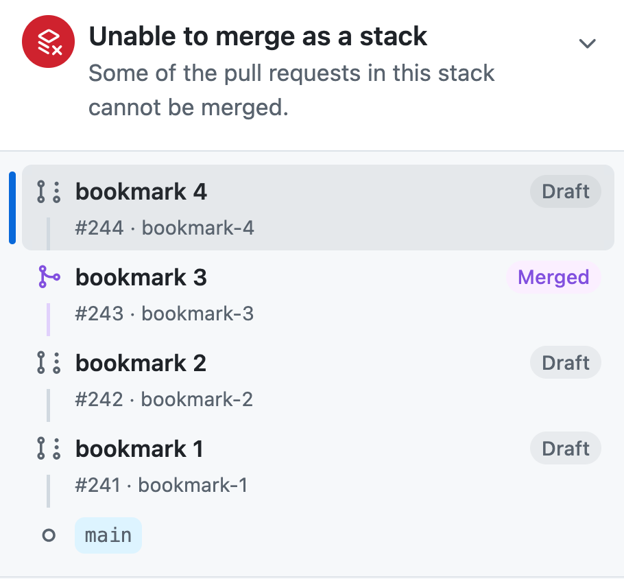

import AIFacts from "@/components/article/AIFacts.astro";
import JJStack from "@/components/article/JJStack.astro";

export const stackBeforeReorder = [
  { id: "main", bookmarks: ["main"], immutable: true },
  { id: "a", bookmarks: ["bookmark-1"], parentIds: ["main"] },
  { id: "b", bookmarks: ["bookmark-2"], parentIds: ["a"] },
  { id: "c", bookmarks: ["bookmark-3"], parentIds: ["b"] },
  { id: "d", bookmarks: ["bookmark-4"], parentIds: ["c"], workingCopy: true },
];

export const stackAfterReorder = [
  { id: "main", bookmarks: ["main"], immutable: true },
  { id: "a", bookmarks: ["bookmark-1"], parentIds: ["main"] },
  { id: "c", bookmarks: ["bookmark-3"], parentIds: ["a"] },
  { id: "b", bookmarks: ["bookmark-2"], parentIds: ["c"] },
  { id: "d", bookmarks: ["bookmark-4"], parentIds: ["b"], workingCopy: true },
];

GitHub released its [stacked pull request (PR) feature](https://github.blog/changelog/2026-07-30-stacked-pull-requests-are-now-in-public-preview/) into public preview on 2026-07-30. It mainly targets git users but has documented support for other, git-compatible version control systems like [Jujutsu (jj)](https://docs.jj-vcs.dev).

This is a primer for using GitHub stacks with jj.

## Prerequisites

### Install CLIs

- You need the `git` ([instructions](https://git-scm.com/book/en/v2/Getting-Started-Installing-Git)) and `jj` ([instructions](https://docs.jj-vcs.dev/latest/install-and-setup/)) CLIs installed.
- You need the `gh` GitHub CLI installed ([instructions](https://cli.github.com/)).
- Install the stacking extension with `gh extension install github/gh-stack`

This article was written/tested against:

- jj v0.43.0
- git v2.52.0
- gh v2.96.0
- github/gh-stack v0.1.0

### Configure jj

I will be re-using some jj aliases and revset aliases we defined in the previous article, [Stacks in Jujutsu](/articles/stacks-in-jujutsu#full-configuration).

### Bonus: Learn `jj`'s bookmark aliases

GitHub's Stacked PRs require every PR to have a `jj` bookmark (git branch), so you'll be creating a lot of these. UI tools in the future will surely automate creating branch names under the covers, but for now, learn the `jj` aliases for easily managing bookmarks:

| Command                     | Description                                                        |
| --------------------------- | ------------------------------------------------------------------ |
| `jj b l`                    | list bookmarks                                                     |
| `jj b s <name> -r <commit>` | Create (or move) a bookmark to the given commit                    |
| `jj b a`                    | Advance the nearest bookmark to the current commit (like `jj tug`) |
| `jj b --help`               | Docs with the aliases for all the commands                         |

<Callout kind="info">
Did you know that you can improve the default `jj bookmark advance` (`jj b a`) behavior by customizing the revset it uses? If you're on a new, empty commit ABOVE a commit with code, you probably want to advance the bookmark to the code commit below you. You can accomplish this with:

```toml title=~/.config/jj/config.toml
[revset-aliases."closest_pushable(to)"]
definition = 'heads(::to & mutable() & ~empty() & description(regex:".+"))'
doc = "Closest mutable, non-empty, described commits at or behind to"

[revsets]
bookmark-advance-to = "closest_pushable(@)"
```

jj makes it super easy to customize behavior by overriding the built-in `bookmark-advance-to` revset to whatever you want.

</Callout>

## Manual Workflows

The `gh stack` CLI has a bunch of subcommands, most of which manage or consume local tracking of the stack (e.g. `init`, `view`). In a jj repo you will only use the few subcommands that manage the remote stack on GitHub (e.g. `link`, `push`), as follows:

### Create a stack

1. Either:

   - Manually create a bookmark for each commit in your stack:
     ```zsh
     # go to the bottom of your stack using our revset alias
     jj bottom --edit
     # give commit a name
     jj b c <name>
     # go to the next commit
     jj next --edit
     # give commit a name
     jj b c <name>
     # ... repeat for each commit in stack
     ```
   - Or push your commits to GitHub with automatic branch names:

     ```zsh
     jj git push --change "stack()"
     ```

     `--change` takes the place of `-r`, also takes a revset argument, and:
     - It uses `templates.git_push_bookmark` to create a bookmark for each change it pushes.
     - `templates.git_push_bookmark` has a default value of `"push-" ++ change_id.short()`, e.g. `push-lltmmqnymopn`, and can be customized.
     - If a change already has a bookmark, `jj git push -c` will NOT use it. It still uses a new `push-lltmmqnymopn` bookmark.
     - If you re-push, it re-uses the existing bookmark.
     - `jj git push -c` is smart about not pushing changes with no description, e.g. if you're on a new empty commit and try to push it with -c you'll get an error.
     - [Lobste.rs users offby1 and bengesoff](https://lobste.rs/c/9v957e) shared their custom templates:
       ```toml
       [template-aliases]
       "slugify(str)" = '''
         truncate_end(
           65,
           str.first_line()
             .replace(regex:'[^[[:alnum:]].]', '-')
             .replace(regex:'-{2,}', '-')
             .replace(regex:'\.{2,}', '.')
             .replace(regex:'(^-+|-+$)', '')
             .lower()
         )
       '''
       git_push_bookmark = 'slugify(description) ++ "/" ++ change_id.short()'
       ```
       With this, `push-lltmmqnymopn` becomes `backend-api-changes/lltmmqnymopn`.

1. Upload your bookmarks to GitHub, create draft PRs for each, and link them all into a stack:

   Using our [stack alias](/articles/stacks-in-jujutsu#stack):

   ```zsh
   gh stack link $(jj sb -r "stack()")
   ```

   Or, using a jj revision range:

   ```zsh
   gh stack link $(jj sb -r commit1::commitN)
   ```

   Or, since `jj sb` defaults to your [substack](/articles/stacks-in-jujutsu#substack), you can go to the [top](/articles/stacks-in-jujutsu#top-and-bottom) (where your stack and substack are the same thing) and then link the entire stack:

   ```zsh
   jj top --edit
   gh stack link $(jj sb)
   ```

   This last one is probably the easiest to remember.

1. Whether you used your own bookmarks or `jj git push --change "stack()"` above, your draft PRs are going to need cleaning up before they're ready to publish, so head to the GitHub web UI and clean up the titles and PR descriptions for each PR, and then mark them as ready to review.

### Add a new commit to the **TOP** of the stack

Assuming the new commit is change id `abc`:

1. Make sure you're editing your new commit:
   ```zsh
   jj edit -r abc
   ```
1. Create a bookmark for the new, current commit:
   ```zsh
   jj b c <name>
   ```
1. If you've modified any of the downstack commits, you need to push the updates (since `jj git push` will do a `--force-with-lease` push, but `gh stack link` won't):
   ```zsh
   jj git push -r "stack()"
   ```
1. Re-run link with all stack bookmarks:
   ```zsh
   gh stack link $(jj sb)
   ```
   The existing PRs (for everything downstack) will be skipped and the new branch will get a new draft PR and will be linked into the stack.

### Add a new commit to the **BOTTOM** or **MIDDLE** of the stack

You can't add to the middle of a stack (you'll get an error: "Cannot update stack: new PRs must be added to the top of the existing stack"), so you have to delete your stack and recreate it. Assuming the new commit is change id `abc`:

1. Go to the GitHub web UI and remove the stack:
   
1. Create a bookmark for the new commit:
   ```zsh
   jj b c -r abc <name>
   ```
1. Since you've modified the rebased, upstack commits, re-push everything:
   ```zsh
   jj git push -r "stack()"
   ```
1. Re-run link with all stack bookmarks, including the new one:
   ```zsh
   jj top --edit
   gh stack link $(jj sb)
   ```
   the existing PRs will be skipped, and the new branch will get a new draft PR and will be linked into the stack

### Remove a commit from the stack

You have to delete your stack and recreate it. Assuming the commit to remove is change id `abc`:

1. Go to the GitHub web UI and remove the stack:
   
1. Make sure you're at the top of the stack:
   ```zsh
   jj top --edit
   ```
1. Abandon the commit if you haven't already:
   ```zsh
   jj abandon -r abc
   ```
1. Push your updates:
   ```zsh
   jj git push -r "stack()"
   ```
1. Re-run link with all stack bookmarks:
   ```zsh
   jj top --edit
   gh stack link $(jj sb)
   ```
   the existing PRs will be skipped and the stack will be recreated
1. Your removed commit will have an orphaned PR on GitHub. Manually close it and/or delete the remote branch if you want. Or, push _all_ deleted bookmarks with `jj git push --deleted`.

NOTE: Deleting the remote branch closes its PR, so if you run the `jj git push --deleted` _before_ re-running `gh stack link ...`, you will end up closing the PR ABOVE the removed branch as well. Delete after linking to avoid this.

### Update the existing commits of an existing stack

<Callout kind="warning">
  This is only safe if you are only updating the contents of the commits and not
  their order. See [Reordering commits](#reordering-commits) to update their
  order.
</Callout>

1. Re-push your stack:
   ```zsh
   jj git push -r "stack()"
   ```

### Merge your stack

Like unstacking, it is theoretically possible to do it from the CLI, but too complicated:

```zsh
gh stack link --open $(jj sb -r "stack()") # draft => published
gh stack merge $(gh pr view "$(jj sb -r "stack()" | awk '{print $NF}')" --json number --jq .number) --yes --squash
```

So, just do this from the web UI. You'll probably be there anyway, checking on that CI signal. 🤷🏽‍♀️

### Reordering commits

<Callout kind="alarm">
  Naively reordering your commits may irreversibly destroy some of your PRs.
  Proceed carefully.
</Callout>

1. Reorder your commits locally, however you want (e.g. `jj arrange`):

   <JJStack
     revisions={stackBeforeReorder}
     after={{ revisions: stackAfterReorder }}
     command="jj arrange"
     caption="Swap the middle two commits. Each bookmark follows its commit, so the stack is now `bookmark-1 bookmark-3 bookmark-2 bookmark-4`, bottom-up."
   />

1. Go to the GitHub web UI and remove the stack:
   
   You have to do this first, since, while a PR is in a stack, GitHub refuses to change its base ("Cannot change the base branch because the pull request is part of a stack").
1. Starting at the bottom-most commit, push each bookmark and retarget the base branch of each PR:

   ```zsh
   # go to the bottom of the stack
   jj bottom --edit
   # re-push the bottom commit
   jj git push -r @
   # retarget bottom commit to base=main (or whatever your base is)
   gh pr edit $(jj sb) --base main

   # then, for each subsequent commit in your stack, one-by-one:
   #   1. re-push the substack
   #   2. re-link the substack, which retargets the PR bases
   for b in $(jj sb -r "stack() ~ stack_bottom()"); do
     jj edit "$b"
     jj git push -r "substack()" &&
     gh stack link $(jj sb) || break
   done
   ```

#### OPTIONAL: Deep dive

Why is reordering commits so fucking complicated, you ask? First, let's see the problem you hit, then we'll explore why you hit it.

Referring back to the same example as before, you have a stack of commits and you reorder the two middle ones:

<JJStack
  revisions={stackBeforeReorder}
  after={{ revisions: stackAfterReorder }}
  command="jj arrange"
  caption="Same as before: swap the middle two commits."
/>

That's the _local_ state. After you run `jj git push -r "stack()"`, the PR for `bookmark-3` will be marked as merged on GitHub:



It cannot be reopened, not with `gh stack link` or any other command.

To explain why it got merged, we need some terminology, [in GitHub parlance](https://docs.github.com/en/rest/pulls/pulls):

- `head` = The branch you are pulling from. The PR source branch.
- `base` = The branch you are merging into. The PR target branch.

GitHub marks a PR as merged whenever a push makes the PR's head reachable from its base branch (`git merge-base --is-ancestor <head> <base>`). That is normally harmless and means you pushed your PR's commits straight to the target branch. For example, if you manually push a version of `main` that has all of a PR's commits, that PR gets marked as "merged." Note that it doesn't actually merge it, it just closes it as already-merged. This automatic merge status sometimes makes sense.

With `jj git push -r "stack()"`, using the [reordering example above](#reordering-commits), when `bookmark-3` is pushed:

- The PR's head branch is `bookmark-3`.
- The PR's base branch is still `bookmark-2`, unchanged.
- The PR's base branch _should be_ `bookmark-1`, but nothing changed it.

GitHub seems to ask "is branch `bookmark-3` reachable from `bookmark-2`?" and, since the answer is "yes", it marks the pull request as merged. A merged PR cannot be reopened, so the PR, its reviews and its comments are closed for good.

And the reason you can't just run `gh stack link` up front to fix all the base branches is that `gh stack link` pushes with a non-forced git push, which is rejected on branches whose commits you've reordered. So the link fails until you push those branches yourself, which you can't safely do for the whole stack at once.

Everything discussed thus far is GitHub behavior in general. It doesn't require stacked PRs, it just requires a set of PRs that target each other and get reordered. When you also start stacking your PRs, GitHub has one new bug after reordering: it erroneously reports `bookmark-3` as merged into `main`:


It is possible that stacked PRs are hard-coded to show that they are merged into the overall stack merge target (`main` in this case), even if the PR itself doesn't target `main`. Bad logic in this edge case, since the stack isn't merged.

## Updates

- 2026-08-14: With [a tip from lobste.rs user bengesoff](https://lobste.rs/s/keiw21/github_stacks_jujutsu#c_tth2ye) there is now an example for using `jj git push --change "stack()"` in the ["Create a stack" section](#create-a-stack)
- 2026-08-14: [Lobste.rs user dominicm asks](https://lobste.rs/c/weg1rv) "The limitation on reordering a stack was a surprise to me. If you do that, I presume you lose all of your reviews after that point too?" See [the new "Reordering commits" section](#reordering-commits) for the answer.

There are almost certainly ways to improve the above workflows that I'm missing. If you have any, [hit me up](/contact) and I'll update this article.

## Impressions and closing

The future improvements I'm hoping for:

1. GUI tools that build upon the manual steps above, automating away the tedium. I personally use the [_amazing_ VisualJJ vscode extension](https://www.visualjj.com) to do 80% of my jj commands and I assume the devs are working on adding GitHub stack support.
1. `gh stack` extension getting a single `gh stack submit` subcommand that just figures stuff out, rendering everything above obsolete.
1. Improvements to the workflows that require deleting the stack and recreating it, e.g. adding a commit to the middle of the stack.
1. Fixes for the extremely sharp edges, e.g. when [reordering commits](#optional-deep-dive).

As it is today, this stuff generally works and I'm _very_ excited to get stacking functionality in GitHub. My initial impression is that one can immediately put this feature to good use, and I'm grateful to the developers that worked on this feature.

That said, let's acknowledge the elephant in the room: this is an unambitious implementation of stacked PRs. GitHub's stacked PRs build entirely on the existing, flawed model of GitHub PRs without changing any of the foundations:

> I apologize for being somewhat direct but what prior art did you engage with? Why are you making people create a branch for each change in a stack? Why do developers have to create new commits when iterating on the PR? Where is the proper support for interdiffs? What about change IDs?
> -sunshowers [on Hacker News](https://news.ycombinator.com/item?id=49117162)

Instead of automatic change ids we get manual branches. Instead of an automatic `gh stack submit` (like [graphite's](https://graphite.com/docs/cheatsheet#syncing-and-submitting) or [git-branchless'](https://github.com/arxanas/git-branchless/wiki/Command:-git-submit) submit commands), you're left feeding `gh stack` the list of branches by hand. Etc.

In short, go in with low expectations of the developer experience and you'll be happy with the end result: a working PR stack in GitHub.

## Production Notes

<AIFacts
  servings="1 serving per container"
  servingSize="About 1 article"
  headline={{ label: "Machine-Written Words", value: "0%" }}
  rows={[
    {
      name: "Prose",
      detail: "Written by hand. Proof-read by machine. Edits applied by hand.",
      value: "0%",
    },
    {
      name: "Code & Config",
      value: "0%",
    },
    {
      name: "Creation",
      detail: "All code/configuration written by hand.",
      value: "0%",
      indent: true,
    },
    {
      name: "Validation",
      detail:
        "All code/configuration programmatically verified by Claude Opus 5 for correctness and consistency. Fixes applied by hand.",
      value: "100%",
      indent: true,
    },
  ]}
  extras={[{ name: "Human Review", value: "100%" }]}
  footnote="% Machine tells you how much  of this article a machine wrote. Values are yolo'd, not a measurement. This label has not been evaluated by the Food and Drug Administration."
/>
