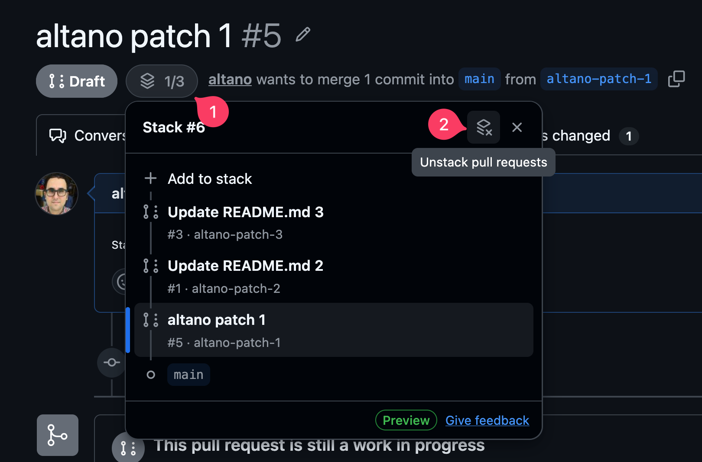

import AIFacts from "@/components/article/AIFacts.astro";

GitHub released it's [stacked pull request (PR) feature](https://github.blog/changelog/2026-07-30-stacked-pull-requests-are-now-in-public-preview/) into public preview on 2026-07-30. It mainly targets git users but has documented support for other, git-compatible version control systems like [Jujutsu (jj)](https://docs.jj-vcs.dev).

This is a primer for using GitHub stacks with jj.

## Prerequisites

### Install CLIs

- You need the `git` ([instructions](https://git-scm.com/book/en/v2/Getting-Started-Installing-Git)) and `jj` ([instructions](https://docs.jj-vcs.dev/latest/install-and-setup/)) CLIs installed.
- You need the `gh` GitHub CLI installed ([instructions](https://cli.github.com/)).
- Install the stacking extension with `gh extension install github/gh-stack`

This article was written/tested against:

- jj v0.43.0
- git v2.52.0
- gh v2.96.0
- github/gh-stack v0.1.0

### Configure jj

I will be re-using some jj aliases and revset aliases we defined in the previous article, [Stacks in Jujutsu](/articles/stacks-in-jujutsu#full-configuration).

### Bonus: Learn `jj`'s bookmark aliases

GitHub's Stacked PRs require every PR to have a `jj` bookmark (git branch), so you'll be creating a lot of these. UI tools in the future will surely automate creating branch names under the covers, but for now, learn the `jj` aliases for easily managing bookmarks:

| Command                     | Description                                                        |
| --------------------------- | ------------------------------------------------------------------ |
| `jj b l`                    | list bookmarks                                                     |
| `jj b s <name> -r <commit>` | Create (or move) a bookmark to the given commit                    |
| `jj b a`                    | Advance the nearest bookmark to the current commit (like `jj tug`) |
| `jj b --help`               | Docs with the aliases for all the commands                         |

<Callout>
💡 Aside: Did you know that you can improve the default `jj bookmark advance` (`jj b a`) behavior by customizing the revset it uses? If you're on a new, empty commit ABOVE a commit with code, you probably want to advance the bookmark to the code commit below you. You can accomplish this with:

```toml title=~/.config/jj/config.toml
[revset-aliases."closest_pushable(to)"]
definition = 'heads(::to & mutable() & ~empty() & description(regex:".+"))'
doc = "Closest mutable, non-empty, described commits at or behind to"

[revsets]
bookmark-advance-to = "closest_pushable(@)"
```

jj makes it super easy to customize behavior by overriding the built-in `bookmark-advance-to` revset to whatever you want.

</Callout>

## Manual Workflows

The `gh stack` CLI has a bunch of subcommands, most of which manage or consume local tracking of the stack (e.g. `init`, `view`). In a jj repo you will only use the few subcommands that manage the remote stack on GitHub (e.g. `link`, `push`), as follows:

### Create a stack

1. Create a bookmark for each commit in your stack:
   ```zsh
   # go to the bottom of your stack using our revset alias
   jj edit -r "stack_bottom()"
   # give commit a name
   jj b c <name>
   # go to the next commit
   jj next --edit
   # give commit a name
   jj b c <name>
   # ... repeat for each commit in stack
   ```
1. Upload your bookmarks to GitHub, create draft PRs for each, and link them all into a stack:

   Using our [stack alias](/articles/stacks-in-jujutsu#stack):

   ```zsh
   gh stack link $(jj sb -r "stack()")
   ```

   Or, using a jj revision range:

   ```zsh
   gh stack link $(jj sb -r commit1::commitN)
   ```

   Or, since `jj sb` defaults to your [substack](/articles/stacks-in-jujutsu#substack), you can go to the [top](/articles/stacks-in-jujutsu#top-and-bottom) (where your stack and substack are the same thing) and then link the entire stack:

   ```zsh
   jj top --edit
   gh stack link $(jj sb)
   ```

   This last one is probably the easiest to remember.

### Add a new commit to the **TOP** of the stack

Assuming the new commit is change id `abc`:

1. Make sure you're editing your new commit:
   ```zsh
   jj edit -r abc
   ```
1. Create a bookmark for the new, current commit:
   ```zsh
   jj b c <name>
   ```
1. If you've modified any of the downstack commits, you need to push the updates (since `jj git push` will do a `--force-with-lease` push, but `gh stack link` won't):
   ```zsh
   jj git push -r "stack()"
   ```
1. Re-run link with all stack bookmarks:
   ```zsh
   gh stack link $(jj sb)
   ```
   The existing PRs (for everything downstack) will be skipped and the new branch will get a new draft PR and will be linked into the stack.

### Add a new commit to the **BOTTOM** or **MIDDLE** of the stack

You can't add to the middle of a stack (you'll get an error: "Cannot update stack: new PRs must be added to the top of the existing stack"), so you have to delete your stack and recreate it. Assuming the new commit is change id `abc`:

1. Go to the GitHub web UI and remove the stack:
   
1. Create a bookmark for the new commit:
   ```zsh
   jj b c -r abc <name>
   ```
1. Since you've modified the rebased, upstack commits, re-push everything:
   ```zsh
   jj git push -r "stack()"
   ```
1. Re-run link with all stack bookmarks, including the new one:
   ```zsh
   jj top --edit
   gh stack link $(jj sb)
   ```
   the existing PRs will be skipped, and the new branch will get a new draft PR and will be linked into the stack

### Remove a commit from the stack

You have to delete your stack and recreate it. Assuming the commit to remove is change id `abc`:

1. Go to the GitHub web UI and remove the stack:
   
1. Make sure you're at the top of the stack:
   ```zsh
   jj top --edit
   ```
1. Abandon the commit if you haven't already:
   ```zsh
   jj abandon -r abc
   ```
1. Push your updates:
   ```zsh
   jj git push -r "stack()"
   ```
1. Re-run link with all stack bookmarks:
   ```zsh
   jj top --edit
   gh stack link $(jj sb)
   ```
   the existing PRs will be skipped and the stack will be recreated
1. Your removed commit will have an orphaned PR on GitHub. Manually close it and/or delete the remote branch if you want. Or, push _all_ deleted bookmarks with `jj git push --deleted`.

NOTE: Deleting the remote branch closes its PR, so if you run the `jj git push --deleted` _before_ re-running `gh stack link ...`, you will end up closing the PR ABOVE the removed branch as well. Delete after linking to avoid this.

### Update the existing commits of an existing stack

1. Re-push your stack:
   ```zsh
   jj git push -r "stack()"
   ```

### Merge your stack

Like unstacking, it is theoretically possible to do it from the CLI, but too complicated:

```zsh
gh stack link --open $(jj sb -r "stack()") # draft => published
gh stack merge $(gh pr view "$(jj sb -r "stack()" | awk '{print $NF}')" --json number --jq .number) --yes --squash
```

So, just do this from the web UI. You'll probably be there anyway, checking on that CI signal. 🤷🏽‍♀️

## Updates

There are almost certainly ways to improve the above workflows that I'm totally missing. If you have one [hit me up](/contact) and I'll update this article.

## Impressions and closing

The future improvements I'm hoping for:

1. GUI tools that build upon the manual steps above, automating away the tedium. I personally use the [_amazing_ VisualJJ vscode extension](https://www.visualjj.com) to do 80% of my jj commands and I assume the devs are working on adding GitHub stack support.
1. `gh stack` extension getting a single `gh stack submit` subcommand that just figures stuff out, rendering everything above obsolete.
1. Improvements to the workflows that require deleting the stack and recreating it, e.g. adding a commit to the middle of the stack.

As it is today, this stuff generally works and I'm _very_ excited to get stacking functionality in GitHub. My initial impression is that one can immediately put this feature to good use, and I'm grateful to the developers that worked on this feature.

That said, let's acknowledge the elephant in the room: this is an unambitious implementation of stacked PRs. GitHub's stacked PRs build entirely on the existing, flawed model of GitHub PRs without changing any of the foundations:

> I apologize for being somewhat direct but what prior art did you engage with? Why are you making people create a branch for each change in a stack? Why do developers have to create new commits when iterating on the PR? Where is the proper support for interdiffs? What about change IDs?
> -sunshowers [on Hacker News](https://news.ycombinator.com/item?id=49117162)

Instead of automatic change ids we get manual branches. Instead of an automatic `gh stack submit` (like [graphite's](https://graphite.com/docs/cheatsheet#syncing-and-submitting) or [git-branchless'](https://github.com/arxanas/git-branchless/wiki/Command:-git-submit) submit commands), you're left feeding `gh stack` the list of branches by hand. Etc.

In short, go in with low expectations of the developer experience and you'll be happy with the end result: a working PR stack in GitHub.

## Production Notes

<AIFacts
  servings="1 serving per container"
  servingSize="About 1 article"
  headline={{ label: "Machine-Written Words", value: "0%" }}
  rows={[
    {
      name: "Prose",
      detail: "Written by hand. Proof-read by machine. Edits applied by hand.",
      value: "0%",
    },
    {
      name: "Code & Config",
      value: "0%",
    },
    {
      name: "Creation",
      detail: "All code/configuration written by hand.",
      value: "0%",
      indent: true,
    },
    {
      name: "Validation",
      detail:
        "All code/configuration programmatically verified by Claude Opus 5 for correctness and consistency. Fixes applied by hand.",
      value: "100%",
      indent: true,
    },
  ]}
  extras={[{ name: "Human Review", value: "100%" }]}
  footnote="% Machine tells you how much  of this article a machine wrote. Values are yolo'd, not a measurement. This label has not been evaluated by the Food and Drug Administration."
/>
