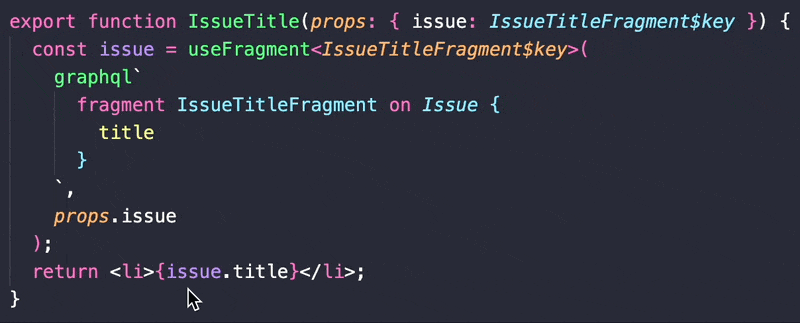
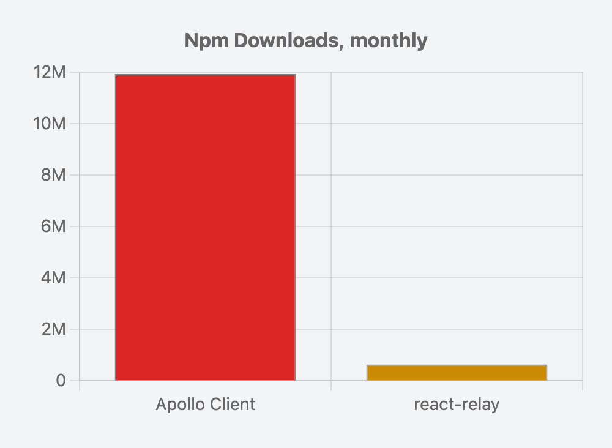

<Translation
  language="ko"
  link="https://emewjin.github.io/relay-style-graphql"
  attributionName="Yujin Lim"
  attributionLink="https://github.com/emewjin"
/>

> "~The future~ Relay-style GraphQL is already here – it's just not evenly distributed."<br />
> – William Gibson, probably

"Relay-style GraphQL" is an opinionated way of consuming GraphQL in a React application, and _probably_ better than whatever you're currently doing. It follows the ideas pioneered by Meta's open-source GraphQL library, [Relay](https://relay.dev/).

Relay does not have a monopoly on these ideas [^guildwork] and you can get pretty far writing Relay-style GraphQL with frameworks like Apollo. Conversely, you can write old school GraphQL in Relay if you try hard enough. Think of this term as defining what most GraphQL code looks like written in a modern version of Relay vs. what most other GraphQL code looks like today, _regardless of what's technically possible_.

## Shifting Goals

Here's a comparison of the high-level goals we had back in 2015 vs. the ones Relay-style GraphQL is trying to solve today:

| **GraphQL in 2015**                                                                                                                                                                                                                                                                                  | **Relay-style GraphQL**                                                                                                                                                                                                                                                                              |
| ---------------------------------------------------------------------------------------------------------------------------------------------------------------------------------------------------------------------------------------------------------------------------------------------------- | ---------------------------------------------------------------------------------------------------------------------------------------------------------------------------------------------------------------------------------------------------------------------------------------------------- |
| <ul><li>A declarative language for querying data </li><li>More flexible than REST, but BE is more exposed </li><li>Prevents some over-fetching </li><li>Performance is ????????????</li><li>Brings back schemas and type safety (that REST took away)</li><li>Better developer experience </li></ul> | <ul><li>UI components can declare their data dependencies </li><li>Safer, faster, and more locked-down than REST </li><li>Never under or over-fetches </li><li>Best-possible performance </li><li>Even better type safety, molded to your components</li><li>Amazing developer experience </li></ul> |

We'll talk about how you might achieve those goals, but first &hellip;

## Some (Optional) History

Meta started GraphQL in 2012 and open-sourced it in 2015. Before GraphQL there was REST, and before that we had SOAP. GraphQL was motivated by a desire to build mobile applications with something better than a REST backend.

Since ~2015 there have been two parallel tracks of evolution (within the web UI community) with surprisingly little cross-pollination:

- The open-source community, dominated by the [Apollo library](https://www.apollographql.com/)
- Meta/Meta's (also open-source) [Relay library](https://relay.dev/)

The open-source community has improved GraphQL, such as all the amazing work [The Guild](https://the-guild.dev/) has done, but the way you use Apollo has remained fundamentally the same since its first release in 2016. Major advancements are slow-going (e.g. [`useFragment` is still experimental](https://www.apollographql.com/docs/react/api/react/hooks-experimental/#usefragment)) and adoption of some great advancements (e.g. [the VS Code Plugin](https://www.apollographql.com/docs/devtools/editor-plugins/)) seem spotty to me.

While Meta's adoption of GraphQL on mobile was an immediate success, it did a much worse job than open-source at embracing its own technology on the web, where it took 10 years to bring it to facebook.com. There were several failed attempts, each failure resulting in a rethinking of the tech stack (e.g. Relay), until eventually succeeding with an approach that looks very different than both where it started and where most of the industry is today.

The fruits of Meta's struggles, plus the lessons learned in open-source, are what I'm dubbing “Relay-style GraphQL.” Not everyone needs all the parts of Relay-style GraphQL, especially not the best-possible performance and backwards compatibility, and all the infrastructure and tooling complexity that entails. However, most of the other advancements are extremely relevant to any application.

## Highlights of Relay-style GraphQL

Relay-style GraphQL is an approach that combines many framework features, best practices, and a different mindset. I'd like to highlight a few of them:

### Fragment Collocation

Fragment collocation means declaring GraphQL fragments directly in your components instead of separate files. Parent components spread their children's fragments into their fragment to be allowed to render their children.

Apollo [supports a lesser form of collocated fragments](https://www.apollographql.com/blog/graphql/fragments/using-graphql-fragments-for-safer-cleaner-and-faster-code/) and [better collocated fragments](https://www.apollographql.com/docs/react/api/react/hooks-experimental/#usefragment) is currently in beta.

Two **critical** principles associated with good use of collocation of fragments are:

- Your component must never receive GraphQL-sourced data in its props: it should only have access to what it declares in its fragment(s).
- Components must never share fragments. Relay enforces that a fragment is prefixed with the component name.

#### An example Relay component

<Code>

```issueSummary.tsx
function IssueSummary(props: {
  issue: IssueSummaryFragment$key;
}) {
  const issue = useFragment(
    graphql`
      fragment IssueSummaryFragment on Issue {
        title
        body
      }
    `,
    props.issue
  );

  return (
    <li>
      <h1>{issue.title}</h1>
      <div>{issue.body}</div>
    </li>
  );
}
```

```tsx
// title (Focus Fragment)
function IssueSummary(props: {
  // focus(1:1)
  issue: IssueSummaryFragment$key;
}) {
  // focus(1:9)
  const issue = useFragment(
    graphql`
      fragment IssueSummaryFragment on Issue {
        title
        body
      }
    `,
    props.issue,
  );

  return (
    <li>
      <h1>{issue.title}</h1>
      <div>{issue.body}</div>
    </li>
  );
}
```

</Code>

The parent component would then spread that fragment in its fragment and render the child component:

```issues.tsx
function Issues(props: {
  repository: IssuesFragment$key | null;
}) {
  // focus(7:7)
  const data = useFragment(
    graphql`
      fragment IssuesFragment on Repository {
        issues(first: 1) {
          nodes {
            __id
            ...IssueSummaryFragment
        }
      }
    `,
    props.repository
  );

  return (
    <ul className={styles.issues}>
      {data?.issues.nodes?.map((issue) => {
        if (issue == null) {
          return null;
        }
        // focus(1:1)
        return <IssueSummary key={issue.__id} issue={issue} />;
      })}
    </ul>
  );
}

```

A top-level component will make a query and (either directly or transitively) spread all the fragments of all its descendent components:

```mainView.tsx
function MainView(props: {
  queryRef: PreloadedQuery<MainViewQuery>;
}) {
  const data = usePreloadedQuery(
    // focus(8:8)
    graphql`
      query MainViewQuery($owner: String!, $name: String!) {
        repository(owner: $owner, name: $name) {
          owner {
            login
          }
          name
          ...IssuesFragment
        }
      }
    `,
    props.queryRef
  );

  // ...
}
```

The result is the same as if you had manually written this top-level query into a `MainViewQuery.graphql` file, like so:

```MainViewQuery.graphql
query MainViewQuery($owner: String!, $name: String!) {
  repository(owner: $owner, name: $name) {
    owner {
      login
    }
    name
    issues(first: 1) {
      edges {
        __id
        node {
          title
          number
          author {
            login
          }
        }
      }
    }
  }
}
```

But, instead of writing this query by hand, a Relay-style GraphQL library will _compile_ your collocated fragments into the same query, giving you many benefits:

#### Benefit #1: Preventing over-fetching

Relay-style GraphQL code has perfect data efficiency, never fetching data it doesn't need.

REST APIs can theoretically fetch exactly the data your UI needs, or they can have flexible query parameters to filter your requested data[^shopify], but in practice they have to over-fetch to serve multiple use cases in your UI. Data provided by REST APIs is usually an ever-increasing superset of what is actually needed by the UI, as pruning of the data is a solvable but often neglected problem.

GraphQL improved on this by allowing the UI author to always request exactly what data they are looking for, in theory always achieving perfect data-fetching efficiency and never over-fetching. The problem arises when you share GraphQL queries/fragments across multiple components: static analysis can't tell you when a field in a `.graphql` file is unused and therefore safe to remove[^over-fetching-static-analysis].

Fragment collocation in Relay-style GraphQL solves this problem: if you remove a field from the component's fragment, or if you just remove the component, and no other component references that field, it will be removed from your query without any action on your part. Relay implements tooling to facilitate all this:

- **Data Masking**: Your component can only see what it puts in its fragment. Your component gets a key via its props but that key isn't usable until fed through something like `useFragment`, and the data returned by `useFragment` only contains the data defined in the component's fragment.
- **Lint rules** that prevent you from doing anything that might result in bad data fetching/passing practices, e.g. adding a field to your fragment only to pass it into a child component, spreading fragments that you don't use directly, etc.
- **TypeScript typing** to prevent rendering a component without spreading its fragment.
- Etc.

#### Benefit #2: Preventing under-fetching

Relay-style GraphQL code doesn't have bugs where components need data that was never queried.

Without fragment collocation it's possible to write a React component that doesn't _always_ get the data it depends on. For example, let's say you have a component that takes a `User` object that has `firstName` and `lastName` fields. Your component knows that these fields are nullable and has appropriate `null` checking, but it can't guarantee that all the queries that use your component include both fields. This can lead to bugs at runtime where your component unexpectedly returns `null`. UI rarely even logs this error case.

With fragment collocation you can be guaranteed that all the data your component needs will always be queried, because you can't render the component without querying. The fields may still end up being `null`, but not because of bugs in your GraphQL code.

#### Benefit #3: Your components are easier to reason about

If your collocated fragments abide by the first principle above:

> "Your component must never receive GraphQL-sourced data in its props: it should only have access to what it declares in its fragment(s)"

they will be much easier to reason about. This is my personal favorite benefit of collocated fragments, and of Relay-style GraphQL in general.

For example, take this standard React component that gets GraphQL data from a prop:

```issueTitle-legacy.tsx
function IssueTitle(props: { issue: { title: string|null } }) {
  return <li>{props.issue.title}</li>;
}
```

This component seems very simple but if you need any information about where this title comes from in order to render the component, you'll have to search elsewhere. Want to use another field in your render? You'll have to add a prop and then go find where the data is sourced so you can add the field there.

Compare it to a GraphQL component with a collocated fragment:

```issueTitle.tsx
function IssueTitle(props: { issue: IssueTitleFragment$key }) {
  const issue = useFragment(
    graphql`
      fragment IssueTitleFragment on Issue {
        title
      }
    `,
    props.issue
  );
  return <p>{issue.title}</p>;
}
```

Here we can easily see that `title` is a field on the `Issue` type.

Want to see the schema documentation for it? Just mouse over the field:



Want to jump to the schema and see related fields? Cmd-click the field from here.

Want to use another field in your render? Just add it right in this component's fragment.

You get the idea.

#### Benefit #4: Improved TypeScript types

If your collocated fragments abide by the second principle above:

> "Components must never share fragments."

they will benefit from much improved TypeScript typing.

It's possible to work in a codebase where TypeScript typing of GraphQL data is bad. There are several ways that can happen. For example:

- Types get widened in the definition of a component prop. For example, a GraphQL type might be a union of string literals but the component's prop widens it to `string`.
- The GraphQL data goes through a transform operation that doesn't keep all the GraphQL types, and what types it does keep get demoted from something specific based on the query. For example, you query for one field but the type you use is the abstract GraphQL type that includes all the fields, all nullable, even though you didn't query for them. In this case your editor's autocomplete will think it potentially has access to all the fields, which is asking for trouble.
- Field types get lost through non-strict typing and vanilla JavaScript.

Even in a codebase with non-strict, non-rigorous TypeScript the typing of GraphQL in a Relay-style component will always be perfect, because your component gets its own auto-generated, custom type that is based on its fragment. The rest of the codebase doesn't matter. And since you're not passing GraphQL data around in props, the types never degrade.

If you don't have a field in your fragment, your TypeScript type won't have it, regardless of whether or not _other_ components query for it. Your TypeScript type perfectly represents your component.

Having a custom TypeScript type for each fragment gives you other developer experience gains as well, [covered later](#required-fields).

#### Benefit #5: Easily re-fetch _just_ your component's data

By separating your GraphQL into fragments you're also setting yourself up to easily re-fetch just the data your component needs instead of the entire query. Relay, for example, [makes it trivial](https://relay.dev/docs/guided-tour/refetching/refreshing-fragments/#using-userefetchablefragment) to upgrade a fragment to a re-fetchable fragment, auto-generating a function that, when called, will send a query for just the data in your fragment.

Without collocated fragments you have to choose between:

- Re-fetching your entire query or
- Manually writing a function that re-fetches just what you want and manually mutating the local cache to reflect the re-fetched data.

Bonus: having globally unique IDs for items in the graph means that re-fetching data for just one component will NOT cause data inconsistencies in your UI. If your auto-generated re-fetch function has data for an item that is rendered by two different components your UI will use the fresh data in both places (using Relay's normalized store[^relay-store]).

#### Benefit #6: Your component can fetch different data, depending on context

##### A (Real-World) Example of a Problem

I have a component in my application that renders data at two stages: once when previewing it, and again after it's saved. During the preview stage, not all the fields are available on the backend (despite having the same type), such as the `id` field. This probably should have been modeled in the schema differently, but let's set that aside. I handled this by adding an `@skip` condition to the fields that weren't available during preview, but the only place to put the `@skip` variable is in a query variable with a default parameter. It ended up looking like this:

```garbage.graphql
query PreviewItemQuery($isForPreview: Boolean = true) {
  ...ItemFragment
}

query SavedItemQuery($isForPreview: Boolean = false) {
  ...ItemFragment
}

fragment ItemFragment on Item {
  id @skip(if: $isForPreview)
}
```

This isn't great because query variables are global variables with no obvious connection to how they are used. Also, it's not a real query variable: I don't expect it to ever get passed into the query and I'm only using it for its default state.

It was also error prone because it was a **_runtime_** error to add this query variable into queries that didn't transitively contain the fragment that used it[^unused-query-variable]. Nothing yelled at me during compile time. This impedance mismatch between what my GraphQL framework allowed me to compile and what my GraphQL server considered a valid query **caused errors in production.**

##### The Solution

How can we do better? For starters, use a GraphQL framework that does enough static analysis to treat the above as a compiler error. But even better: use fragment arguments! Fragment arguments are basically just function arguments for your GraphQL fragments. Here's what a [fragment argument definition](https://relay.dev/docs/api-reference/graphql-and-directives/#argumentdefinitions) looks like in Relay:

```previewItem.tsx
function PreviewItem(props: {
  item: PreviewItemFragment$key;
}) {
  const item = useFragment(
    // focus(2:6)
    graphql`
      fragment PreviewItemFragment on Item @argumentDefinitions(
        isForPreview: { type: "Boolean!" }
      ) {
        id @skip(if: $isForPreview)
        title
      }
    `,
    props.item
  );

  // ...
}
```

Which then enforces, at compile time, that this argument is passed to every spread of the fragment:

```preview.tsx
...PreviewItemFragment @arguments(isForPreview: true)
```

And by being right next to the collocated fragment when defined, used, and invoked you never have to guess why the argument exists or how it is used.

#### Benefit #7: Better GraphQL APIs

Collocated fragments encourage you to build simple GraphQL APIs that are tailored to your UI components. It pushes you to move data complexity up to the backend, where it (often) belongs.

#### Benefits Summary

**If you only absorb one thing, make it this:** switching from hand-written GraphQL queries (whether you break them up into fragments or not) to GraphQL fragments collocated with your React components has many downstream benefits that instantly spoil you and make it impossible to go back.

### Data Fetching

Relay-style GraphQL makes it easy to have pretty-good data-fetching performance while enabling high-effort, best-possible performance.

#### Easy, pretty-good performance

This is your baseline. For no effort, all your GraphQL fragments are compiled and batched into queries. **You should have 1 GraphQL network request per page/route**, so that on page load you make 1 GraphQL query after your React components begin rendering.

This is already better than the average Apollo app and possibly good enough for:

- Enterprise/internal applications.
- Applications with a captive audience that won't leave if performance isn't the best it can be.
- Anything where shaving hundreds of milliseconds off page load time isn't worth the developer cost of doing better.
- Applications with users on better computers & internet connections.
- Applications that have mostly desktop users.
- Etc.

#### Medium-effort, better performance

The next level of performance comes from decoupling data fetching from React rendering. The React team advocates [render-as-you-fetch](https://legacy.reactjs.org/blog/2019/11/06/building-great-user-experiences-with-concurrent-mode-and-suspense.html#render-as-you-fetch) instead of fetch-on-render, which Relay-style GraphQL facilitates (with features like [compiled, persisted queries](#persisted-queries) and [query preloading](https://relay.dev/docs/api-reference/use-preloaded-query)). When a person hits enter in the URL bar, your server should start fetching and streaming data in parallel to sending down the original HTML document. When a person clicks a button to open a `modal` with lazily-loaded contents, your server should start fetching the data for the `modal` (in parallel to the JS code powering the `modal`) as soon as the button is clicked. **In this model you have 0 GraphQL network requests (from the client) per page/route, and 1 network request for every user interaction that initiates the need for more data.**

This is good enough for just about every application, for example:

- Applications with users on high-latency mobile connections.
- Applications where more developer effort is worth the performance gains.
- Etc.

#### High-effort, best-possible performance

After batching larger and larger chunks of GraphQL into single queries, you'll potentially run into issues where disproportionately slow field resolvers hold up the entire data fetch. Relay solves this by giving you the ability to control individual fields using the `@defer` and `@stream` directives.

Additionally, there are niche problems that aren't caused by GraphQL but can be fixed by it. For example, let's say you have a forum where people can make different kinds of posts and there is one React component to render each kind of post. Over time you've accumulated 1,000 kinds of posts which has caused your bundle size to balloon to something huge. You've observed that 98% of posts can be rendered with five components but the long tail of components all get used some small amount. What do you do? One solution: abandon client rendering and make your components non-interactive. An alternative: Relay's [Data-Driven Dependencies (3D)](https://relay.dev/docs/glossary/#3d) allows you to base what JS you send down to the client on what GraphQL data you're about to return from the server. So you could include the five most-used components in your main bundle, always ready, and additionally send down just the React components needed to render the posts in the GraphQL response you're about to send down.

While these aren't common concerns, a Relay-style GraphQL framework should give you this level of control _when needed_.

This is good enough for every single application, including:

- Applications with billions of users where milliseconds saved is worth huge amounts of developer time.
- Applications with developers who can't help but implement the fastest option even though it isn't a good use of their time.

### Persisted Queries

GraphQL APIs give the UI developer the power to query for whatever they want directly from the client, but that comes with two problems:

1. You're potentially sending down huge query documents to your clients only to have them turn around and send them back up to the server. This is a waste of bandwidth.
2. Accepting arbitrarily complex queries from any client can be a serviceability and efficiency nightmare, and potentially a security risk[^persisted-query-security]. One way developers have dealt with this is by calculating query complexity and then rate-limiting the API. That approach only makes sense in certain circumstances.

One solution to both of these problems is to use [persisted queries](https://relay.dev/docs/guides/persisted-queries/#the-persistconfig-option). This involves persisting your compiled queries somewhere accessible to the backend and assigning them a unique ID. Subsequently, only the unique ID is sent to your clients. Then, your JS application needs only to send back that unique ID and the accompanying query variables to the GraphQL server when executing a query. This approach eliminates bandwidth waste and restricts queries to those written by your UI developers, preventing arbitrary actors from sending unauthorized queries through the JS console.

### React Suspense Support

Relay fully supports React Suspense. Most other GraphQL libraries support it in at least an experimental mode, and the React team has declared Suspense [stable for “opinionated data fetching frameworks.”](https://react.dev/reference/react/Suspense) The benefits to component readability and removing error-prone loading logic are good enough to start using it now.

### Developer Experience

There are a lot of developer experience benefits to Relay-style GraphQL but I'd like to highlight two:

#### @required fields

GraphQL allows you to define non-nullable fields at the schema level, but it is [well established](https://graphql.org/learn/best-practices/#nullability) that you should avoid doing so lest you cause resiliency and backwards-compatibility headaches for yourself. There is an incredibly high bar for using non-nullable fields in the schema.

That said, the bar inside your _component_ is not nearly as high. It is reasonable when writing a component to say “if I don't have this field, I might as well not render anything.” Relay has an [`@required` directive](https://relay.dev/docs/next/guides/required-directive/) that allows you to replace code like this:

```issueSummary.tsx
function IssueSummary(props: {
  issue: IssueSummaryFragment$key;
}) {
  const issue = useFragment(
    // focus(2:7)
    graphql`
      fragment IssueSummaryFragment on Issue {
        title
        body
        closed
        createdAt
      }
    `,
    props.issue
  );

  // focus(1:8)
  if (
    issue.title == null ||
    issue.body == null ||
    issue.closed == null ||
    issue.createdAt == null
  ) {
    return null;
  }

  return (
    <li>
      <h1>{issue.title}</h1>
      <p>{issue.body}</p>
      <p>{issue.closed}</p>
      <p>{issue.createdAt}</p>
    </li>
  );
}
```

with code like this:

```issueSummary.tsx
function IssueSummary(props: {
  issue: IssueSummaryFragment$key;
}) {
  const issue = useFragment(
    // focus(2:7)
    graphql`
      fragment IssueSummaryFragment on Issue {
        title @required(action: LOG)
        body @required(action: LOG)
        closed @required(action: LOG)
        createdAt @required(action: LOG)
      }
    `,
    props.issue
  );

  // focus(1:3)
  if (issue == null) {
    return null;
  }

  return (
    <li>
      <h1>{issue.title}</h1>
      <p>{issue.body}</p>
      <p>{issue.closed}</p>
      <p>{issue.createdAt}</p>
    </li>
  );
}
```

That might not be a huge number of characters saved but:

- You're no longer keeping two lists of fields in sync.
- Your TypeScript types are immediately what you want: either the entire issue is null, or you have all the fields you require as non-nullable.
- The Relay version logs to your telemetry endpoint when a field is unexpectedly `null` instead of the code on the left which just silently ignores it.
- `@required` supports other behavior, such as throwing an exception if a field is `null`, for when that makes sense. These exceptions are thrown at a single choke point with structured data about the fragment/field that eroded, making them easy to setup global monitoring for regressions. That makes these errors highly actionable in a way that you might not get with ad-hoc error logging.
- You can use `@required` to bubble a `null` field up through the component hierarchy in a way that doesn't work with just returning `null`.
- Etc.

#### Language Server Protocol / VS Code Extension

By moving GraphQL into your components you're also moving the benefits of your language-server protocol closer to your components. See [above](#benefit-3-your-components-are-easier-to-reason-about) for how you get schema documentation right in your components.

### And more!

There is a TON of stuff I haven't covered, such as [declarative mutation directives](https://relay.dev/docs/guided-tour/updating-data/graphql-mutations/#declarative-mutation-directives), [type-safe optimistic responses](https://relay.dev/docs/guided-tour/updating-data/graphql-mutations/#optimistic-response), the benefits of [tighter integration between your GraphQL server and UI](https://relay.dev/docs/guides/graphql-server-specification/), [Relay Resolvers](https://relay.dev/docs/guides/relay-resolvers/), Relay's normalized store with a better memory footprint and better garbage collection than a response cache, a baked-in [pagination implementation](https://relay.dev/docs/guided-tour/list-data/pagination/), faster & more efficient React renders when data updates, etc. The list just keeps going.

## What's Not Great

Hopefully by this point I've made the case that Relay-style GraphQL is a fundamentally better approach to consuming GraphQL APIs from a React application. If you're wondering if there are any things that aren't amazing about this style (or Relay itself), I've got some for you:

1. Apollo has [19x the downloads](https://npmtrends.com/@apollo/client-vs-react-relay) that Relay has on npm:
   
   If your engineering org skews junior and relies heavily on how much more there is written about Apollo than Relay, then maybe you should stick to Apollo. Or maybe you're just risk averse and you like using what everyone else is using. Or maybe you take comfort in using what everyone else is using instead of what one random fucking internet blog post says you should use. Or maybe you just like big bars.
2. Relay-style GraphQL requires a compiler step. Relay, for example, has a compiler[^relay-compiler] that you have to leave running in watch mode as you develop.
3. Relay's documentation is pretty good but it's not perfect. There are areas that are severely under-documented, especially as you get into advanced features that only Meta is using.
4. Relay works best when it integrates with your GraphQL server. This is called the [GraphQL Server Specification](https://relay.dev/docs/guides/graphql-server-specification/) and outlines things like having globally unique IDs, supporting the `@connection` directive, and providing a `Node` interface. This is a good thing, and makes your life better, but in some organizations a UI engineer might have very little control over the GraphQL server implementation, making this a blocker for unlocking the full potential of Relay.

## FAQ

<QuestionHeading>

### Q: Why do I need Relay-style GraphQL if &hellip;

</QuestionHeading>
<QuestionBody>
  I'm already using collocated fragments with Apollo, I never share fragments between components, I'm using graphql-code-generator to generate types for every fragment, and I type all of my input props using the generated fragment type?
</QuestionBody>

<Answer>
  (1) You're using Apollo in a way that I've never seen in the real world. It
  sounds great and you should be proud of yourself for independently inventing
  some great practices that are basically Relay-style GraphQL. (2) Apollo does
  not facilitate enforcing any of this. There is no config option or lint rule
  you can turn on to make it so that you have to stick to this pattern. With
  Relay, everything about this style is statically enforced.
</Answer>

<QuestionHeading>

### Q: Will Relay fall apart &hellip;

</QuestionHeading>

<QuestionBody>
  in a complex, real-world application? These examples are really simple.
</QuestionBody>

<Answer>No.</Answer>

<QuestionHeading>

### Q: How do you unit test &hellip;

</QuestionHeading>

<QuestionBody>Relay components?</QuestionBody>

<Answer>
  I've only worked on codebases that leaned very heavily on end-to-end testing
  for React components (and only unit tested non-UI-component JS code). But, if
  you're interested, [here's a bunch of
  stuff](https://relay.dev/docs/guides/testing-relay-components/) you can read
  on how to do it!
</Answer>

<QuestionHeading>

### Q: Do collocated fragments ever result in conflicts &hellip;

</QuestionHeading>

<QuestionBody>
  between how you query for data in one component vs. another, for example
  querying for the same root field but with different arguments? Do I have to
  start manually aliasing fields in all of my components?
</QuestionBody>

<Answer>
  No, Relay handles this for you. If you pass different arguments to the same
  field in two different fragments, they will each get the correct data
  (reflecting their respective arguments) without having to manually alias
  anything.
</Answer>

<QuestionHeading>

### Q: Will Relay take away control I have over &hellip;

</QuestionHeading>

<QuestionBody>whether or how the query cache is used?</QuestionBody>

<Answer>
  No, Relay's `fetchPolicy` gives you pretty good control over network behavior.
  That said, you obviously can't control it at the granularity of a fragment
  (what would that even mean[^refetchable-fetch-policy]), so if you need that
  you'll have to separate your component out into a lazily-loaded one
  ([`useLazyLoadQuery`](https://relay.dev/docs/api-reference/use-lazy-load-query/)
  facilitates this).
</Answer>

[^guildwork]: The Guild is [working on](https://the-guild.dev/blog/unleash-the-power-of-fragments-with-graphql-codegen) bringing these ideas to other libraries.
[^over-fetching-static-analysis]: _Static_ analysis has a hard time with this because GraphQL has abstract types for many fields, and those references could theoretically be tracked across your codebase, but the leaf fields are always primitive types (like `string` and `number`) and tracking references to primitive values across an entire codebase, across all code boundaries, is not a problem anyone has solved (to my knowledge). That said, _runtime_ analysis using JS `Proxy` can be used to detect what fields go unused with some level of accuracy. [Reddit Engineering wrote about it here](https://www.reddit.com/r/RedditEng/comments/x0rasj/identifying_unused_fields_in_graphql/). Runtime analysis is better than nothing, but strictly worse than just getting it exactly right at compile time.
[^relay-store]: Relay's cache is [a normalized, in-memory object graph](https://relay.dev/docs/principles-and-architecture/runtime-architecture/#data-model).
[^data-in-props]: Too many of my Relay nerd friends cringed at this line because it's not true. You actually receive the key to the data in the props, which can be used to lookup the data in the Relay store.
[^relay-compiler]: Don't worry, Relay's compiler [is written in Rust](https://relay.dev/blog/2021/12/08/introducing-the-new-relay-compiler/).
[^refetchable-fetch-policy]: It might be neat if [`useRefetchableFragment`](https://relay.dev/docs/api-reference/use-refetchable-fragment/) took a `refetchPolicy` argument. Maybe?
[^shopify]: For example, here is [Shopify's order retrieval API](https://shopify.dev/docs/api/admin-rest/2023-07/resources/order#get-orders?status=any). They went to pains to add a `fields` parameter so you can specify a comma-delimited list of fields to fetch. But, some of the fields, like `client_details`, have fields nested below it. You can't filter those. So even when a REST API goes out of its way to add some level of filtering, it still isn't going to make it possible to arbitrarily filter perfectly, because then the API's ergonomics increasingly suffer (and at some point you're just reinventing an ad-hoc GraphQL endpoint). Back when REST APIs were all that there was, in my experience internal/private REST APIs rarely even had a "fields" parameter and over-fetching was extremely prevalent.
[^persisted-query-security]: By locking down your API to exactly what your UI needs you're engaging in "defense in depth" security. This shouldn't be your main mechanism for hiding sensitive/private data that you don't want clients to see, but not letting users make arbitrary queries against your backend is a reasonable security precaution.
[^unused-query-variable]: My GraphQL server rejects queries with unused query variables.
