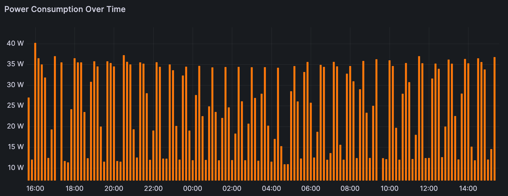
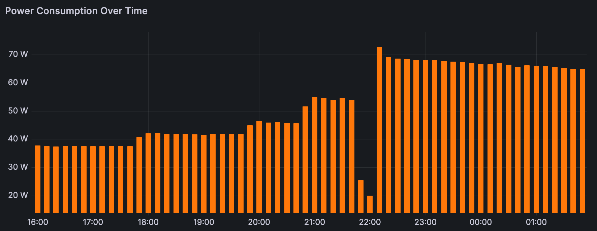
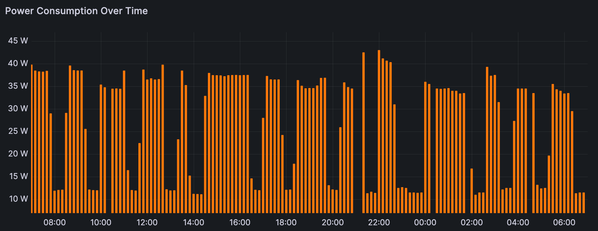

Behold: power consumption data on Instagram's favorite drink fridge, the [Rocco "Super Smart Fridge."](https://roccofridge.com/products/the-super-smart-fridge)

## Mostly Empty

I measured an average of 25.3 W of power usage during a 24-hour period (or ~18 kWh/month). The fridge was mostly empty and opened a handful of times. The power usage varies on a pretty consistent ~37 minute cycle, fluctuating between ~11 W and ~35 W:

## Filled with Drinks

When loading an empty fridge with drinks, the average went up to 49.2 W over a 10-hour period:

After 10 hours the fridge returned to a lower 27.7 W of average power usage, 2.4 W higher than the empty fridge, with a slightly different looking cycle:

This surprised me. I thought a fridge full of drinks would use less power than an empty fridge.

## Method

All this power data was collected by a Sonoff S31 Smart Plug, flashed with Tasmota (from CloudFree which [sells them pre-flashed](https://cloudfree.shop/product/sonoff-s31/)). I pipe all my power consumption data to InfluxDB (running inside Home Assistant) and graph it with Grafana.
