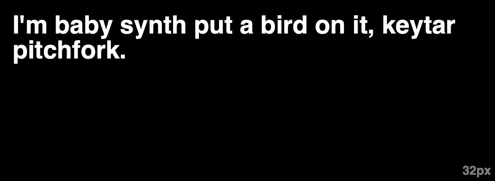

import { SatoriFitTextBasicSandbox } from "./sandboxes/satori-fit-text/basic";

There are many JavaScript libraries for fitting text to fill a container by finding the ideal font size, but these libraries don't work well in environments outside the browser, e.g. static site generators, dynamic code that runs on a server, etc.

[@altano/satori-fit-text](https://www.npmjs.com/package/@altano/satori-fit-text) bridges the gap by allowing you to fit text to a container in any environment that [vercel/satori](https://github.com/vercel/satori) supports[^satori-support].

## Demonstration

{/* use html table so we can make widths 50% each (instead of it being based on the differently sized th) */}

<table>
  <thead>
    <tr>
      <th style={{ fontSize: "1.25rem", paddingBottom: 0 }}>
        Hard-coded font size
      </th>
      <th style={{ fontSize: "1.25rem", paddingBottom: 0 }}>
        @altano/satori-fit-text font size
      </th>
    </tr>
  </thead>
  <tbody>
    <tr>
      <td style={{ width: "50%" }}></td>
      <td style={{ width: "50%" }}></td>
    </tr>
  </tbody>
</table>

## Installation

```sh
# Using NPM
npm install @altano/satori-fit-text
# Using Yarn
yarn add @altano/satori-fit-text
# Using PNPM
pnpm add @altano/satori-fit-text
```

## Example: Open Graph Card

If you're rendering open graph cards in something like [Next.js](https://nextjs.org/) you may want the text of your cards to be dynamic text (e.g. the title of a blog post) but also fill up the entire card. Instead of hard-coding the font size, which isn't feasible in this case, use @altano/satori-fit-text in opengraph-image.tsx:

```ts
import { findLargestUsableFontSize, type Font } from "@altano/satori-fit-text";

async function getInter(): Promise<Font> {
  // ...
}

export default async function Image() {
  const title = "The homepage of this site.";
  const font = await getInter();
  const opengraphDimensions = {
    width: 1200,
    height: 630,
  };

  const titleFontSize = await findLargestUsableFontSize({
    text: title,
    font: font,
    maxWidth: opengraphDimensions.width,
    maxHeight: opengraphDimensions.height,
  });

  const card = (
    <main
      style={{
        lineHeight,
        padding: 0,
        margin: 0,
      }}
    >
      <h1
        style={{
          margin: 0,
          fontSize: titleFontSize,
        }}
      >
        {title}
      </h1>
    </main>
  );

  return new ImageResponse(card, {
    ...opengraphDimensions,
    fonts: [font],
  });
}
```

[Here is a fully-fleshed out, basic example codesandbox](https://codesandbox.io/p/sandbox/altano-satori-fit-text-next-js-demo-sv4flc?file=/app/opengraph-image.tsx).

You can find a more [complicated example here](https://github.com/altano/alan.norbauer.com/blob/main/src/components/opengraph/image.tsx) that I use on this website where I have a title and a subtitle and I use multiple font weights.

## Example: Node.js CLI App

Check out [this codesandbox](https://codesandbox.io/p/sandbox/github/altano/npm-packages/tree/main/codesandboxes/satori-fit-text-node-cli?file=%2Fpackage.json%3A1%2C1) if you want to see a Node.js CLI app that computes the ideal font size for certain dimensions.

## Example: Browser/React Component

There are less roundabout solutions[^altano-textfit] if you're going to only fit text in a browser, but the library does technically work just fine there.

NOTE: The sandbox below does _not_ work in Firefox. Satori can be made to work in Firefox but you'll have to setup an `Intl.Segmenter` polyfill first[^intl-segmenter], which I haven't bothered to do.

<br />

<SatoriFitTextBasicSandbox />

[^altano-textfit]: [@altano/textfit](https://www.npmjs.com/package/@altano/textfit) doesn't require intermediate svg files and can more quickly fit text using only the DOM.
[^satori-support]: [vercel/satori](https://github.com/vercel/satori) can currently "be used in browser, Node.js (>= 16), and Web Workers."
[^intl-segmenter]: Using [intl-segmenter-polyfill](https://www.npmjs.com/package/intl-segmenter-polyfill) is [recommended by Satori's maintainers](https://github.com/vercel/satori/issues/14#issuecomment-1532644426).
