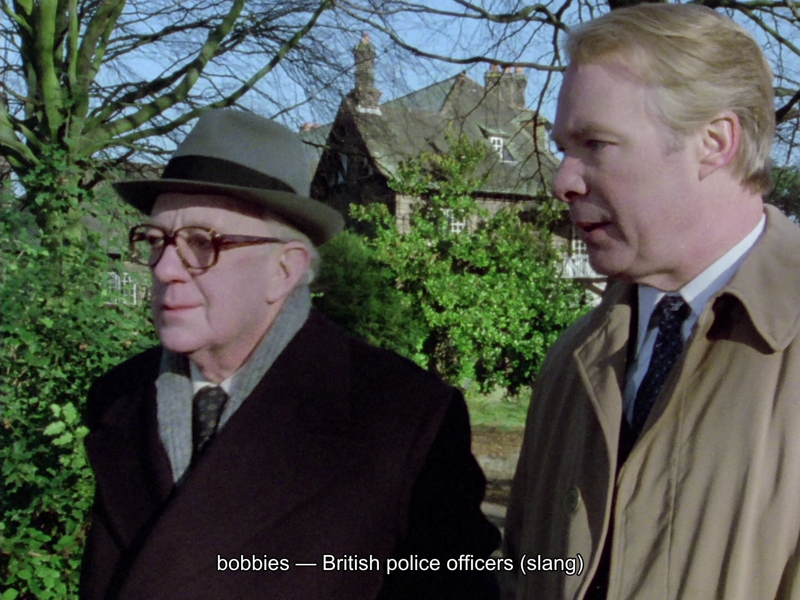

---
tags:
  - le Carré
  - hopcraft
  - espionage
  - glossary
  - tinker tailor soldier spy
  - smiley's people
title: le Carré's Circus, Explained
description: Explanations for jargon, codenames, and tradecraft from Tinker Tailor Soldier Spy and Smiley's People
date_created: 2026-07-12T06:54:27.853Z
date_updated: 2026-07-13T23:42:09.549Z
---

My household watches Arthur Hopcraft's TV adaptations of John le Carré's [_Tinker Tailor Soldier Spy_](https://www.imdb.com/title/tt0080297) (1979) and [_Smiley's People_](https://www.imdb.com/title/tt0083480/) (1982) multiple times per year. Both series are among finest ever produced, but they can be pretty inscrutable at times. Therefore, I've created a glossary of the slang, codenames, and tradecraft that are used throughout.[^invented]

[^invented]: Much of this vocabulary was invented by le Carré; some of it later passed into real intelligence usage and even widespread common use (e.g. "mole").

There are two ways to enjoy this glossary: download the [subtitles](#subtitles) to display the definitions while you watch the show or read the [definitions on this page](#definitions), below.

## Subtitles

The **"Explainers"** subtitle track for both BBC series: it pops up a short, plain-English definition the moment one of these terms is spoken. Each term is only defined once, the first time it appears in the series.

There are two kinds of track:

- **Explainers**: definitions only, nothing else. Turn it on over the picture (with the show's own subtitles off) to get just the pop-up definitions.
- **English + Explainers**: the full English dialogue subtitle with each definition folded in, shown in [square brackets] under the line that triggers it. Use this as your one subtitle track if you also want the dialogue subtitled. These also fix a couple of typos in the original subtitles (e.g. "point-black" -> "point-blank").

### Examples

#### Explainer-only Subtitles

When several terms land close together, the definitions stack:

#### English + Explainers

The same `bobbies` scene looks like this on the **English + Explainers** track, with the definition under the subtitled dialogue in square brackets:

![The same frame as the bobbies shot above, now on the English + Explainers track: the dialogue "A lot of ex-colonial bobbies ploughing through the Circus files?" is subtitled with "[bobbies — British police officers (slang)]" in brackets beneath it](./explainer-eng-example.png)

### Download

- [Tinker, Tailor, Soldier, Spy (1979) - Explainer Subtitles](/articles/tinker-tailor-smileys-people-glossary/tinker-tailor-soldier-spy-1979-explainers.zip) (all 7 parts)
- [Smiley's People (1982) - Explainer Subtitles](/articles/tinker-tailor-smileys-people-glossary/smileys-people-1982-explainers.zip) (all 6 episodes)

{/* prettier-ignore */}
<Callout>⚠️ The timings are matched to the UK releases (the 7-part _Tinker Tailor_ and the 6-part _Smiley's People_). These will **not** sync up properly to the American release.</Callout>

Each track comes in two formats:

- **`.ass`** (🤭): explicitly styled (small, centered, lightly boxed text).
- **`.srt`**: most widely compatible (it works in virtually every player) but drops the custom styling.

When in doubt, use the `.srt`. Either manually load the subtitle file or rename it to match your video and put it in the same folder so your video player picks it up automatically.

### Updates

#### 2026-07-13: Czech dialogue

Both series are in English apart from scattered foreign-language moments, most left untranslated. The exception is the Czech-language scene that opens _Tinker Tailor_ Part 1. Since the original subtitles translate it, Part 1's Explainers (definitions-only) subtitle track was updated to fold those Czech lines in, as you'd never want that scene untranslated. Every other Explainers track was left as definitions only.

### Reporting Issues

If you find any errors with the subtitles, [email me](mailto:alan@norbauer.com) and I'll address them.

## Definitions

### The Circus

<dl>
  <dt>The Circus</dt>
  <dd>
    The headquarters and, by extension, the whole of the British Secret Service
    in le Carré's novels. Named for its (fictional) home at Cambridge Circus in
    London.
  </dd>
  <dt>Control</dt>
  <dd>
    The ailing spymaster who runs the Circus at the outset of{" "}
    <em>Tinker Tailor</em>, known only by this title. Smiley's chief and mentor.
  </dd>
  <dt>The fifth floor</dt>
  <dd>
    The top floor of the Circus, home to its senior management; shorthand for
    the leadership of the service.
  </dd>
  <dt>Janitors</dt>
  <dd>
    The Circus' doorkeepers, duty staff, and porters who man the building.
  </dd>
  <dt>Lamplighters</dt>
  <dd>
    The section, based at Acton, that provides surveillance, watchers, couriers,
    transport, and safe houses. Run by Toby Esterhase; they do the legwork of
    physical observation and support.
  </dd>
  <dt>Scalphunters</dt>
  <dd>
    The section, based in Brixton, that carries out the jobs too dirty or
    dangerous for officers posted abroad: blackmail, abduction, burglary,
    assassination — the "wet" work. Peter Guillam runs them; Jim Prideaux was
    one.
  </dd>
  <dt>Inquisitors</dt>
  <dd>
    The interrogators and debriefers, based at Sarratt, who question defectors,
    returning agents, and suspects.
  </dd>
  <dt>Babysitters</dt>
  <dd>Bodyguards; officers assigned to protect someone.</dd>
  <dt>case officer</dt>
  <dd>the officer who runs an agent</dd>
  <dt>chief hood</dt>
  <dd>the top spy / intel officer (hood = operative)</dd>
  <dt>dogs</dt>
  <dd>surveillance watchers set to shadow you (spy slang)</dd>
  <dt>fabricator</dt>
  <dd>someone who invents &amp; sells fake intelligence</dd>
  <dt>ferrets</dt>
  <dd>technicians who sweep a room for hidden bugs</dd>
  <dt>juju man</dt>
  <dd>witch-doctor; here, the boss who ran each region</dd>
  <dt>London Station</dt>
  <dd>the all-powerful foreign-operations arm of the Circus</dd>
  <dt>magic circle</dt>
  <dd>the inner group cleared for the secret</dd>
  <dt>minder</dt>
  <dd>a bodyguard or handler</dd>
  <dt>our Joe</dt>
  <dd>a recruited agent / asset (spy slang)</dd>
  <dt>provocateur</dt>
  <dd>incites others into acts that discredit / entrap them</dd>
  <dt>resident</dt>
  <dd>a spy posted long-term in a foreign country</dd>
  <dt>resident clerk</dt>
  <dd>a Foreign Office live-in out-of-hours duty officer</dd>
  <dt>security mob</dt>
  <dd>MI5, Britain's domestic security service</dd>
  <dt>talent spotters</dt>
  <dd>scouts who spot people worth recruiting</dd>
</dl>

### The opposition

<dl>
  <dt>Moscow Centre (the Centre)</dt>
  <dd>
    Headquarters of Soviet intelligence (the KGB); the Circus' principal
    adversary.
  </dd>
  <dt>Karla</dt>
  <dd>
    The legendary spymaster of Moscow Centre's Thirteenth Directorate, Smiley's
    personal nemesis, and the man who ran the mole inside the Circus. "Karla" is
    a workname; his real name is never given.
  </dd>
  <dt>The cousins</dt>
  <dd>The Americans; the CIA.</dd>
</dl>

### Tradecraft

<dl>
  <dt>Tradecraft</dt>
  <dd>
    The collective techniques of espionage: surveillance, secret communication,
    recruitment, concealment, and clandestine meetings.
  </dd>
  <dt>Legend</dt>
  <dd>
    A fabricated life-history and cover identity, detailed enough to survive
    scrutiny.
  </dd>
  <dt>Dead letter box (DLB) / dead drop</dt>
  <dd>
    A prearranged hiding place where one agent leaves material for another to
    collect later, so the two never have to meet.
  </dd>
  <dt>Cut-out</dt>
  <dd>
    An intermediary — a person or a dead drop — placed between two parties so
    that neither can betray the other directly.
  </dd>
  <dt>Crash meeting</dt>
  <dd>
    An emergency meeting called outside the normal schedule when something has
    gone wrong.
  </dd>
  <dt>Honey trap</dt>
  <dd>
    The use of a sexual or romantic relationship to seduce, compromise, or
    recruit a target.
  </dd>
  <dt>Coat-trailing / dangle</dt>
  <dd>
    Deliberately trailing a person or piece of bait in front of the opposition
    to provoke a recruitment approach.
  </dd>
  <dt>Chickenfeed</dt>
  <dd>
    Genuine-looking but low-value or doctored intelligence fed to the other side
    to build up a double agent's credibility.
  </dd>
  <dt>Reptile fund</dt>
  <dd>
    A secret pool of untraceable money kept for paying agents and financing
    operations off the books.
  </dd>
  <dt>Blown</dt>
  <dd>
    Exposed; an agent, identity, or operation whose cover has been compromised.
  </dd>
  <dt>Moscow Rules</dt>
  <dd>
    The most stringent tradecraft, reserved for the most hostile ground, where
    the opposition is assumed to be watching everything.
  </dd>
  <dt>Burn</dt>
  <dd>leverage used to coerce someone into cooperating (spy)</dd>
  <dt>all-stations trace</dt>
  <dd>a records check sent to every overseas station</dd>
  <dt>appreciation</dt>
  <dd>a formal military assessment or analysis</dd>
  <dt>cleft stick</dt>
  <dd>split stick used to carry a written message by runner (dated)</dd>
  <dt>Counsellor</dt>
  <dd>a senior embassy diplomat (rank below ambassador)</dd>
  <dt>D-notice</dt>
  <dd>official UK request to the press not to publish on security grounds</dd>
  <dt>diplomatic bag</dt>
  <dd>a sealed official pouch, exempt from customs</dd>
  <dt>escapes</dt>
  <dd>emergency false passports for fleeing (spy jargon)</dd>
  <dt>first flash</dt>
  <dd>the first urgent intelligence signal</dd>
  <dt>head of chancery</dt>
  <dd>an embassy's senior administrative diplomat</dd>
  <dt>lace-curtain</dt>
  <dd>extremely discreet, undetectable surveillance (spy)</dd>
  <dt>Queen's Messengers</dt>
  <dd>Britain's official diplomatic couriers</dd>
  <dt>rolled up</dt>
  <dd>(of a spy network) captured / dismantled</dd>
  <dt>scalped</dt>
  <dd>killed / taken out (spy slang)</dd>
  <dt>soft route</dt>
  <dd>unwatched, low-risk travel route (spy jargon)</dd>
  <dt>Source Merlin</dt>
  <dd>
    The supposed high-level Soviet source said to be behind the Witchcraft
    material.
  </dd>
  <dt>spike</dt>
  <dd>to bug a place with hidden microphones</dd>
  <dt>Witchcraft</dt>
  <dd>
    The operation, championed by Alleline, that delivered seemingly priceless
    Soviet intelligence to the Circus — material so good it bought political
    favour. In truth it was chickenfeed planted by Karla to protect and promote
    his mole.
  </dd>
  <dt>work name</dt>
  <dd>a spy's operational cover-name / alias</dd>
</dl>

### Places

<dl>
  <dt>Brixton</dt>
  <dd>The south London base of the scalphunters.</dd>
  <dt>Brno</dt>
  <dd>city in Czechoslovakia, near the Austrian border</dd>
  <dt>canton</dt>
  <dd>a Swiss state / province</dd>
  <dt>Sarratt ("the Nursery")</dt>
  <dd>
    The Circus' training school in Hertfordshire, where new officers are trained
    and burnt-out agents are debriefed and recover.
  </dd>
</dl>

### Soviet &amp; Eastern-bloc terms

<dl>
  <dt>collegium</dt>
  <dd>the ruling council of the Soviet intelligence service</dd>
  <dt>commissar</dt>
  <dd>a Soviet Communist Party official</dd>
  <dt>dacha</dt>
  <dd>a Russian country house</dd>
  <dt>Dzerzhinsky Square</dt>
  <dd>Moscow site of KGB headquarters</dd>
  <dt>Iron Curtain</dt>
  <dd>the Cold War divide between Soviet East and West</dd>
  <dt>Lubyanka</dt>
  <dd>KGB headquarters &amp; prison in Moscow</dd>
  <dt>Magyar</dt>
  <dd>a Hungarian</dd>
  <dt>Oberbaumbrücke</dt>
  <dd>a bridge crossing between East &amp; West Berlin</dd>
  <dt>patronymic</dt>
  <dd>a name taken from one's father (e.g. Borisovna)</dd>
  <dt>Tass</dt>
  <dd>the official Soviet state news agency</dd>
  <dt>uprising of '68</dt>
  <dd>1968 Prague Spring, crushed by Soviet invasion</dd>
</dl>

### British institutions, schools &amp; culture

<dl>
  <dt>Admiralty</dt>
  <dd>Britain's naval command / government dept</dd>
  <dt>Ascot</dt>
  <dd>a famous British horse-racing course</dd>
  <dt>Britain-can-make-it</dt>
  <dd>evoking the 1946 "Britain Can Make It" industry exhibition</dd>
  <dt>Bulldog Drummond</dt>
  <dd>a 1920s British fictional action hero</dd>
  <dt>Burglar Bill</dt>
  <dd>a stock British burglar figure (children's-story character)</dd>
  <dt>Callot</dt>
  <dd>Jacques Callot, 17th-century French printmaker</dd>
  <dt>Chelsea pensioner</dt>
  <dd>a red-coated retired British soldier</dd>
  <dt>Cotswolds</dt>
  <dd>a scenic, rural region of England</dd>
  <dt>don</dt>
  <dd>a senior university teacher</dd>
  <dt>Eton</dt>
  <dd>an elite, costly British boarding school</dd>
  <dt>evensong</dt>
  <dd>evening church service, often sung (Anglican)</dd>
  <dt>Fleet Street</dt>
  <dd>the British national newspaper press</dd>
  <dt>Foreign Office</dt>
  <dd>UK ministry for foreign affairs (≈ US State Dept.)</dd>
  <dt>Fortnum's</dt>
  <dd>Fortnum &amp; Mason, a posh London store</dd>
  <dt>head boy</dt>
  <dd>top-ranking pupil at a British school; here, the boss</dd>
  <dt>Home Office</dt>
  <dd>UK ministry for domestic / interior affairs</dd>
  <dt>Laughing Cavalier</dt>
  <dd>a famous 1624 Frans Hals portrait</dd>
  <dt>Lord's</dt>
  <dd>London's most famous cricket ground</dd>
  <dt>Matron</dt>
  <dd>the nurse / head of pupil care (British school)</dd>
  <dt>nonconformist</dt>
  <dd>a Protestant outside the Church of England</dd>
  <dt>prefect</dt>
  <dd>a pupil given authority over others (UK schools)</dd>
  <dt>prep school</dt>
  <dd>British private school for younger children</dd>
  <dt>redbrick</dt>
  <dd>a non-elite British university (not Oxford/Cambridge)</dd>
  <dt>Remembrance Day</dt>
  <dd>UK holiday honoring the war dead (Nov 11)</dd>
  <dt>Roedean</dt>
  <dd>an elite English girls' boarding school</dd>
  <dt>The Savoy</dt>
  <dd>a famous luxury London hotel</dd>
  <dt>sea lords</dt>
  <dd>the Royal Navy's most senior officers</dd>
  <dt>Securicor</dt>
  <dd>a British private security company</dd>
  <dt>Travellers'</dt>
  <dd>an exclusive London gentlemen's club</dd>
  <dt>West Country</dt>
  <dd>rural southwest England (Devon / Cornwall)</dd>
  <dt>Westminster</dt>
  <dd>an elite London private school (not Parliament here)</dd>
  <dt>Whitehall</dt>
  <dd>shorthand for the British government</dd>
</dl>

### Money &amp; betting

<dl>
  <dt>betting tout</dt>
  <dd>someone who sells horse-racing tips (British)</dd>
  <dt>bob</dt>
  <dd>a shilling; old British money slang</dd>
  <dt>death duties</dt>
  <dd>British inheritance tax</dd>
  <dt>football pools</dt>
  <dd>a UK soccer-results betting game</dd>
  <dt>guinea</dt>
  <dd>old British coin = 21 shillings (£1.05)</dd>
  <dt>packet</dt>
  <dd>a large sum of money (British slang)</dd>
  <dt>quid</dt>
  <dd>one pound (British slang for money)</dd>
  <dt>standing order</dt>
  <dd>automatic recurring bank payments (British)</dd>
  <dt>under starter's orders</dt>
  <dd>(British, from horse racing) lined up and about to begin</dd>
</dl>

### British slang &amp; everyday words

<dl>
  <dt>Alvis</dt>
  <dd>a defunct British luxury car brand</dd>
  <dt>Atlantic man</dt>
  <dd>pro-US, transatlantic-alliance minded</dd>
  <dt>bairn</dt>
  <dd>a small child, baby (Scots)</dd>
  <dt>bird</dt>
  <dd>a girlfriend / woman (British slang)</dd>
  <dt>blue movies</dt>
  <dd>pornographic films (dated slang)</dd>
  <dt>bobbies</dt>
  <dd>British police officers (slang)</dd>
  <dt>boiler suits</dt>
  <dd>one-piece work coveralls (British)</dd>
  <dt>bollocks</dt>
  <dd>rubbish / nonsense (British slang)</dd>
  <dt>Bolshie</dt>
  <dd>Communist / left-wing (short for Bolshevik)</dd>
  <dt>bonny</dt>
  <dd>healthy and good-looking (British / Scots)</dd>
  <dt>bounder</dt>
  <dd>a cad; a dishonorable man (dated British)</dd>
  <dt>call box</dt>
  <dd>public telephone booth (British)</dd>
  <dt>caravan</dt>
  <dd>a towable trailer home / RV (British)</dd>
  <dt>cheeky</dt>
  <dd>brazenly impudent / bold (British)</dd>
  <dt>chin-wag</dt>
  <dd>a chat / natter (British slang)</dd>
  <dt>the chop</dt>
  <dd>getting fired / sacked (British slang)</dd>
  <dt>chuck it in</dt>
  <dd>to quit or give up (British slang)</dd>
  <dt>chummy</dt>
  <dd>the suspect or fellow in question (British police slang)</dd>
  <dt>clever boots</dt>
  <dd>the clever one / smarty-pants (British)</dd>
  <dt>comic</dt>
  <dd>the newspaper one writes for (journalists' slang)</dd>
  <dt>commercial traveler</dt>
  <dd>a traveling salesman (dated British)</dd>
  <dt>commissionaire</dt>
  <dd>a uniformed doorman / attendant (British)</dd>
  <dt>common-or-garden</dt>
  <dd>ordinary, commonplace (British)</dd>
  <dt>cosh and carry</dt>
  <dd>a cosh is a bludgeon; a pun on 'cash and carry'</dd>
  <dt>crisps</dt>
  <dd>potato chips (British)</dd>
  <dt>Czecho</dt>
  <dd>slang for Czechoslovakia</dd>
  <dt>despatch box</dt>
  <dd>locked case for a minister's official state papers (British)</dd>
  <dt>devilling</dt>
  <dd>doing minor background or odd-job work (dated British)</dd>
  <dt>diabolical liberty</dt>
  <dd>an outrageous cheek / nerve (British)</dd>
  <dt>en poste</dt>
  <dd>serving in one's official post (French)</dd>
  <dt>factotum</dt>
  <dd>a servant who handles all sorts of odd jobs</dd>
  <dt>featherhead</dt>
  <dd>a silly, scatterbrained person</dd>
  <dt>fey</dt>
  <dd>whimsical, eccentric, or oddly otherworldly (dated)</dd>
  <dt>flannel merchants</dt>
  <dd>smooth-talking bullshitters; all talk, no substance (British)</dd>
  <dt>Flash Harry</dt>
  <dd>a flashy, showy man (British slang)</dd>
  <dt>fleshpots</dt>
  <dd>places of luxury and sensual indulgence</dd>
  <dt>flogged</dt>
  <dd>sold off (British slang)</dd>
  <dt>footer</dt>
  <dd>football, i.e. soccer (dated British)</dd>
  <dt>footpad</dt>
  <dd>an old word for a street robber on foot</dd>
  <dt>Frog</dt>
  <dd>French / the French language (dated slang)</dd>
  <dt>funk</dt>
  <dd>a coward (dated British slang)</dd>
  <dt>galloping major</dt>
  <dd>blustering, horse-mad ex-cavalry officer (dated British)</dd>
  <dt>gents</dt>
  <dd>the men's toilet (British)</dd>
  <dt>harridan</dt>
  <dd>a bossy, scolding old woman</dd>
  <dt>having it off</dt>
  <dd>having sex (British slang)</dd>
  <dt>heavy mob</dt>
  <dd>the muscle; tough enforcers (slang)</dd>
  <dt>hols</dt>
  <dd>holidays; vacation (British slang)</dd>
  <dt>hugger-mugger</dt>
  <dd>jumbled together in disorder; a confused muddle (archaic)</dd>
  <dt>impedimenta</dt>
  <dd>encumbering baggage — here, his girl and child</dd>
  <dt>in his cups</dt>
  <dd>drunk (dated)</dd>
  <dt>in the pink</dt>
  <dd>in excellent health (idiom)</dd>
  <dt>Jonah</dt>
  <dd>someone who brings bad luck (biblical)</dd>
  <dt>kip</dt>
  <dd>a sleep / nap (British slang)</dd>
  <dt>lorry</dt>
  <dd>a truck (British)</dd>
  <dt>Ludo</dt>
  <dd>a British board game (like Parcheesi)</dd>
  <dt>made the running</dt>
  <dd>(British idiom) set the pace; took the visible lead</dd>
  <dt>minicab</dt>
  <dd>a phone-booked private taxi (British)</dd>
  <dt>mod cons</dt>
  <dd>modern conveniences (British)</dd>
  <dt>my Aunt Fanny</dt>
  <dd>nonsense! / my foot! (British)</dd>
  <dt>My hat</dt>
  <dd>exclamation of surprise or disbelief (dated British)</dd>
  <dt>nappies</dt>
  <dd>diapers</dd>
  <dt>natter</dt>
  <dd>a chat; casual talk (British)</dd>
  <dt>nervy</dt>
  <dd>jittery, anxious (British — not the US 'bold')</dd>
  <dt>odd bods</dt>
  <dd>eccentric or strange people (British slang)</dd>
  <dt>Persil white</dt>
  <dd>spotlessly clean; innocent (from a British detergent)</dd>
  <dt>piano</dt>
  <dd>quiet, subdued (from the musical term)</dd>
  <dt>pigs-in-clover</dt>
  <dd>people wallowing in easy affluence (idiom)</dd>
  <dt>pink gin</dt>
  <dd>gin with bitters; a British drink</dd>
  <dt>potty</dt>
  <dd>silly, slightly crazy (British informal)</dd>
  <dt>pound to a penny</dt>
  <dd>almost certain; I'd bet on it (idiom)</dd>
  <dt>prezzies</dt>
  <dd>presents / gifts (British slang)</dd>
  <dt>proles</dt>
  <dd>the low-ranking common workers</dd>
  <dt>removers</dt>
  <dd>a moving / removals company (British)</dd>
  <dt>Ronson</dt>
  <dd>a brand of cigarette lighter</dd>
  <dt>rum</dt>
  <dd>odd, strange, peculiar (dated British)</dd>
  <dt>shop-soiled</dt>
  <dd>slightly tarnished, like used shop goods (British)</dd>
  <dt>shopping</dt>
  <dd>informing on someone (British slang)</dd>
  <dt>shower</dt>
  <dd>a contemptible, useless bunch (British slang)</dd>
  <dt>slap-up dinner</dt>
  <dd>a lavish meal (British)</dd>
  <dt>solicitor</dt>
  <dd>a British lawyer (paperwork, not courtroom)</dd>
  <dt>splash</dt>
  <dd>a big front-page news story (journalism)</dd>
  <dt>squeeze-box</dt>
  <dd>an accordion / concertina</dd>
  <dt>Swan Vestas</dt>
  <dd>a British brand of matches</dd>
  <dt>teetotal</dt>
  <dd>never drinks alcohol</dd>
  <dt>tinpot</dt>
  <dd>petty, trivial, third-rate</dd>
  <dt>tisane</dt>
  <dd>a herbal tea / infusion</dd>
  <dt>topped</dt>
  <dd>killed, murdered (British slang)</dd>
  <dt>tripe</dt>
  <dd>nonsense, rubbish (dated British)</dd>
  <dt>tripping the light fantastic</dt>
  <dd>to dance lightly to music</dd>
  <dt>turned up trumps</dt>
  <dd>came through; turned out well (British idiom)</dd>
  <dt>whacked</dt>
  <dd>exhausted (British)</dd>
  <dt>without the option</dt>
  <dd>compulsory; allowing no choice (dated British)</dd>
  <dt>worth the candle</dt>
  <dd>worth the effort or cost (dated idiom)</dd>
  <dt>Wotcher</dt>
  <dd>a greeting: hi / hello (British slang)</dd>
  <dt>would be favourite</dt>
  <dd>the best or most likely option (British slang)</dd>
  <dt>zizz</dt>
  <dd>a nap or short sleep (British slang)</dd>
  <dt>émigré</dt>
  <dd>an exile who fled the Soviet bloc</dd>
</dl>
