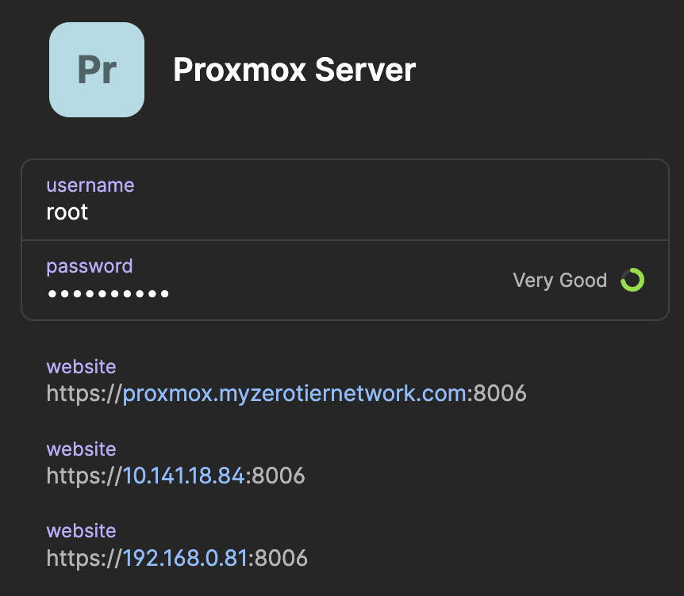

I integrated ZeroNS into my homelab so I could use domain names for all my ZeroTier nodes. I was very impressed with ZeroNS so I'm sharing how I did it and my thoughts on how the integration went.

_NOTE: ZeroNS is in beta as of 2022/02/26. "Here be Dragons (still)."_

## Why DNS?

Without DNS we connect to ZeroTier nodes by IP address. This isn't too annoying because ZeroTier IP addresses don't change, but why memorize/hard-code IP addresses when you can use domain names?

## Why ZeroNS?

- ZeroNS is written by the folks at ZeroTier, specifically [Erik Hollensbe](https://github.com/erikh).
- It's written for ZeroTier specifically so it introspects your ZeroTier network to automatically serve DNS records without manual configuration.
- ZeroNS is made to be a node in your ZeroTier network. It's not a public, generic DNS server: it can only be accessed inside your ZeroTier network (according to your rules).
- It's simple to install and setup.
- The author is very responsive and engaged with the project.

## How does it work?

With everything in place, any ZeroTier client configured with "Allow DNS Configuration" will send DNS queries that end in your domain name (e.g. `*.myzerotiernetwork.com`) to the ZeroNS server. Other DNS queries (e.g. `google.com`) will continue going to wherever you normally send DNS queries, e.g. your ISP or a Pi-hole or whatever. It'll look like this:


This per-interface DNS resolution works automatically on Windows and macOS. The [project's readme](https://github.com/zerotier/zeronsd#per-interface-dns-resolution) has some guidance on how you might get this to work on Linux clients.

That means:

- if your ZeroNS server goes down, only DNS for your domain will stop working, e.g. `google.com` will continue to resolve to an IP.
- ZeroNS has a 1:1 mapping to each ZeroTier Network/NIC. Each ZeroNS daemon will be accessible from (and serve) only one ZeroTier network.

## Prerequisites

- A ZeroTier network, the associated network id
- A registered domain name (that you dedicate entirely to ZeroTier DNS for [reasons](https://github.com/zerotier/zeronsd/issues/118))
- Tested on ZeroTier v1.8.3 and ZeroNS v0.3.1

## Setup

ZeroNS has [a great quick-start tutorial](https://docs.zerotier.com/zeronsd/quickstart/) so you should just go look at that. Everything below is hopefully complementary to it.

### Domain name

What TLD to use for your homelab is a contentious topic. There are a few things you definitely _don't_ want to do, like using `.local` (reserved for mDNS). If you're going to use a made-up domain that isn't something you own and isn't publicly resolvable, you should use the ZeroNS default of `.home.arpa` which is ["designated for non-unique use in residential home networks."](https://datatracker.ietf.org/doc/html/rfc8375).

My preference is to use a unique, public TLD that I own the domain for. You don't actually need to configure your domain at your registrar for DNS at all. Nothing else needs to serve DNS for it. We're registering it to reserve it (so that no one else registers it and adds public DNS records for it). You'll also need to dedicate the entire domain to ZeroNS. For the rest of this article we'll assume you own `myzerotiernetwork.com`.

### Provisioning an API token

Follow [the quickstart guide for provisioning your API token](https://docs.zerotier.com/zeronsd/quickstart/#provision-an-api-token-from-zerotier-central).

### Where to run the daemon?

I opted for manual installation of ZeroNS in an Alpine Linux VM on my Proxmox host, but:

- ZeroNS [supports Docker](https://github.com/zerotier/zeronsd#docker). It has [official images](https://hub.docker.com/r/zerotier/zeronsd) (Debian default or Alpine option) and also example `Dockerfile`s in the repo ([Debian](https://github.com/zerotier/zeronsd/blob/main/Dockerfile)/[Alpine](https://github.com/zerotier/zeronsd/blob/main/Dockerfile.alpine)). The Docker setup is MUCH easier as 90% of the instruction below is to support setting up a VM from scratch. I still went with a VM though because I treat my Docker setup as low availability for non-critical infra.
- If you have trouble installing it on Alpine (e.g. the system service fails to install) you can always try Debian. Erik [is enthusiastically supporting Alpine](https://github.com/zerotier/zeronsd/pull/128) but while things are in beta you don't know what might break.

### Setting up the ZeroNS Daemon

[The quickstart](https://docs.zerotier.com/zeronsd/quickstart/#install-zeronsd) has a comprehensive section on installation but here's what I did in my Alpine VM in Proxmox:

- Create Alpine Linux VM on Proxmox, named "zeronsd"
  - iso: alpine-virtual, x86_64
  - hostname = `zeronsd`
  - disk = 10gb
  - 8 vCPU cores, 1024mb memory (we can lower this to 2 vCPU/128MB after installing Alpine/ZeroNS. I'm throwing resources at the install to speed it up)
- Start VM, open Proxmox console, login:
  - user=root, password=empty (type nothing)
  - `setup-alpine`
  - Select defaults
  - Set your local timezone
  - Set a root password
  - Format disk: select `sda`, `lvm`, `sys`, and `y`
  - `reboot`
- Login as root
- Fix apk
  - `apk add nano`
  - `nano /etc/apk/repositories`
  - uncomment "alpine/v3.15/community", save
  - `apk update`
- Setup sshd however you like. I disable password auth and only allow pubkey authentication.
- Install ZeroTier, setup network (replace `af78bf94364e2035` with your network ID)
  ```bash
  apk add zerotier-one
  service zerotier-one start
  zerotier-cli join af78bf94364e2035
  zerotier-cli set af78bf94364e2035 allowDNS=1
  zerotier-cli get af78bf94364e2035 allowDNS
  ```
- Authorize the node in ZeroTier Central
- install rust + zeronsd
  - `apk add rust cargo openssl openssl-dev git`
  - `cargo install zeronsd`
  - `/root/.cargo/bin/zeronsd --version`
  - OPTIONAL: now would be a good time to lower the VM's vCPU/memory allocation if you'd like, e.g. to 2 vCPU/128MB
- Write the API token [you got earlier](#provisioning-an-api-token) to a file
  - `echo "<API-TOKEN>" > ~/.token`
  - chmod 600 ~/.token
- Test (use your domain and ZT network ID)
  - `/root/.cargo/bin/zeronsd start --token /root/.token --wildcard --domain myzerotiernetwork.com -v af78bf94364e2035`
  - You can ignore errors like `could not lookup SOA for authority`
  - https://my.zerotier.com should now have `Search Domain = myzerotiernetwork.com` and `SERVERS = <zeronsd's ZT IP>`
  - If there are no errors, `ctrl-c`
- Setup init.d service (use your domain and ZT network ID)
  ```
  /root/.cargo/bin/zeronsd supervise -t /root/.token -w -d myzerotiernetwork.com af78bf94364e2035
  rc-update add zeronsd-af78bf94364e2035
  rc-service zeronsd-af78bf94364e2035 start
  rc-status default # verify started
  ```
- `reboot`
- validate zeronsd and zerotier-one are running with `rc-status`
- OPTIONAL: Verify that everything works (on any Linux machine on the ZT network):
  - Assume:
    - zeronsd has ZT IP `10.146.12.30`
    - a host in your ZT network with name `face` has ZT IP `10.146.12.40`
  - Run:
    - `dig +short @10.146.12.30 face.myzerotiernetwork.com`
    - Response should be: `10.146.12.40`
    - If this doesn't work, check if you need to [configure your ZeroTier flow rules](#zerotier-flow-rule-configuration)

And you're done! Commands to note for future use:

- To restart zeronsd:
  - `rc-service zeronsd-af78bf94364e2035 restart`
- To upgrade zeronsd:
  - `cargo install zeronsd`
- To upgrade zerotier
  - upgrade alpine:
    ```
    nano /etc/apk/repositories` and update version (e.g. "v3.15" or "latest-stable")
    apk update
    apk add --upgrade apk-tools
    apk upgrade --available
    sync
    reboot
    ```
    _From [Alpine docs](https://wiki.alpinelinux.org/wiki/Upgrading_Alpine#Upgrading_from_older_versions)_
  - upgrade just zerotier-one pkg if new one is available on current alpine version
    `apk add --upgrade zerotier-one`
- To see why something might not be working, stop the service and run on the CLI with verbose logging:

  ```
  rc-service zeronsd-af78bf94364e2035 stop
  /root/.cargo/bin/zeronsd start -vvv --token /root/.token --wildcard --domain myzerotiernetwork.com -v af78bf94364e2035

  ```

## Client Configuration

All clients that are to use your new ZeroNS server must have "Allow DNS Configuration" checked in their ZeroTier client (or, only headless machines, you can use `zerotier-cli set af78bf94364e2035 allowDNS=1`).

## ZeroTier Flow Rule Configuration

If you haven't customized your ZeroTier flow rules, you can skip this section. If you have, and you've locked down traffic, you'll need a hole for ZeroNS since, presumably, every node in your ZeroTier network needs to be able to talk to the ZeroNS daemon. After some [discussion](https://github.com/zerotier/zeronsd/issues/124) of the best way to poke that hole here's what I settled on:

- Create a `dnsserver` tag. We flip it to on for the ZeroNS server only.
- We create a rule that allows udp and arp through for any traffic where either side is the dns server:

  ```
  tag dnsserver
    id 1001
    default 0
    flag 0 is_dns_server
  ;

  # Allow all UDP and ARP traffic with DNS servers
  accept
    tor dnsserver 1
    and ipprotocol udp
  ;
  accept
    tor dnsserver 1
    and ethertype arp
  ;
  ```

  You'll want to include those rules before any other rules that might deny dns traffic.

- Make sure to check the flag for your ZeroNS node:
  

## Alternatives to ZeroNS

### Public DNS Records

An alternative is to (manually) create public DNS records for any nodes you want in your ZeroTier network. For example, create an A record `face.myzerotiernetwork.com = <ZT IP>` for host `face`.

Pros:

- Uptime: you can let someone else (e.g. Cloudflare) host these DNS entries somewhere with high uptime
- Easy setup: no need to setup a dedicated ZeroNS server

Cons:

- You leak your ZeroTier IP addresses onto the public internet. This should be totally safe barring a vulnerability.
- You have to manually create the DNS entries whenever you add/remove nodes in your ZT network

### Custom DNS Server

Your ZeroTier network can be configured to accept the IP of any DNS server so you can run any kind of server you want at that IP address. It'll be up to you to run one that makes sense for your setup, but you are by no means limited to running a ZeroNS server.

## Last Thoughts

### Comparison to Tailscale

ZeroNS might not be as simple as [Tailscale's MagicDNS](https://tailscale.com/kb/1081/magicdns/), but like all things Tailscale vs. ZeroTier, you have a lot more flexibility in exchange for slightly more difficulty. For example, you can:

- use your own custom domain name (Tailscale uses `<prefix>.tailscale.net`)
- use ZeroTier's flow rules to limit DNS traffic to a subset of your network
- [serve non-ZeroTier DNS records](https://docs.zerotier.com/zeronsd/quickstart/#serving-non-zerotier-records) from ZeroNS (either custom records you define or public DNS fall-through)
- etc

Speaking of Tailscale, I'm jealous of [the automatic TLS certificates](https://tailscale.com/kb/1153/enabling-https/) feature. They use `.tailscale.net` to point to your machine so they have enough control to be able to give you an automatic cert. I assume this isn't coming to ZeroTier anytime soon.

### Password Managers

One of 1Password's great features is that it let's you add multiple addresses for a single entry. I add 3 addresses for all my ZeroTier nodes: (1) `xxx.myzerotiernetwork.com`, (2) the ZeroTier IP, and (3) the local LAN IP. For example, the entry for my Proxmox server looks like this:



This makes it so that if, for whatever reason, DNS resolution stops working, I can still easily find and login to my Proxmox server. The LAN IP is helpful for when I need to go entirely around ZeroTier while I'm on my LAN (only valid for nodes that listen on the LAN IP, which only a subset of my nodes do).

## Reference

- [Official ZeroNS Documentation](https://docs.zerotier.com/zerons/quickstart/)
- [ZeroNS source code](https://github.com/zerotier/zeronsd)
