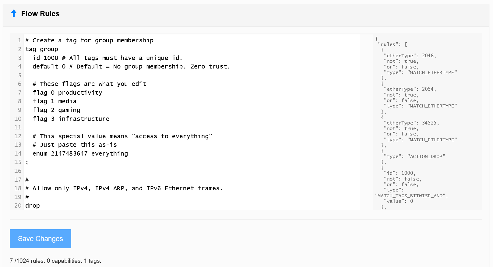
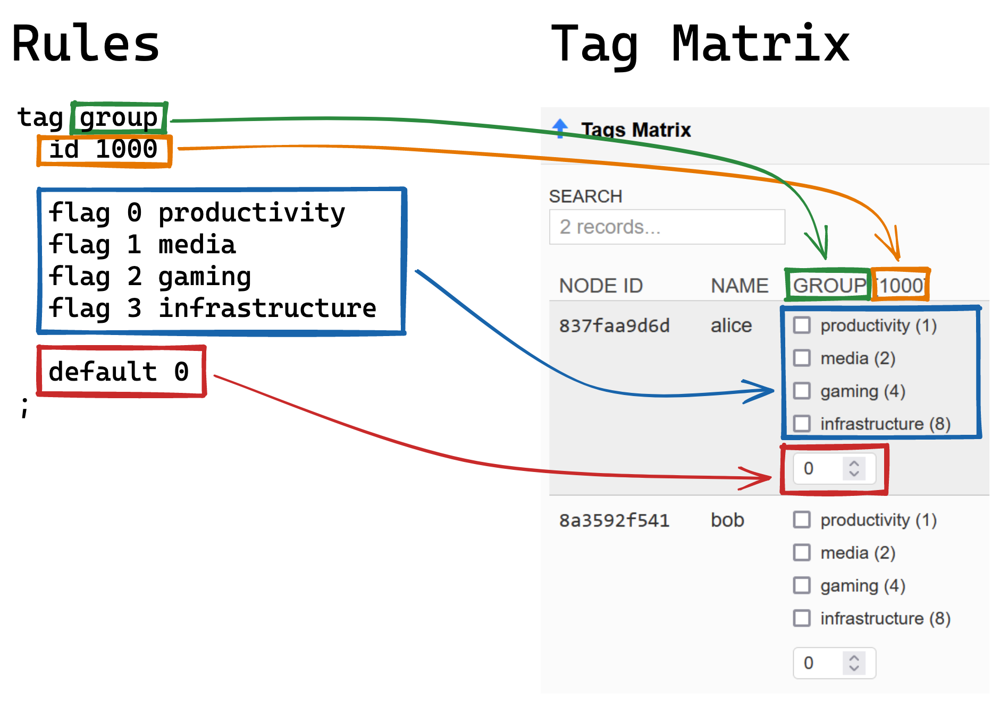
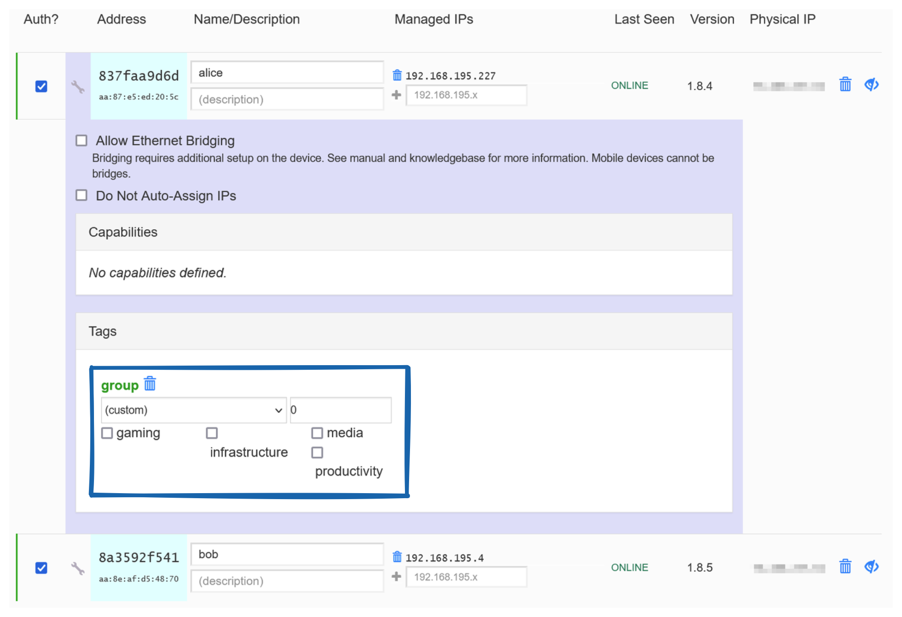
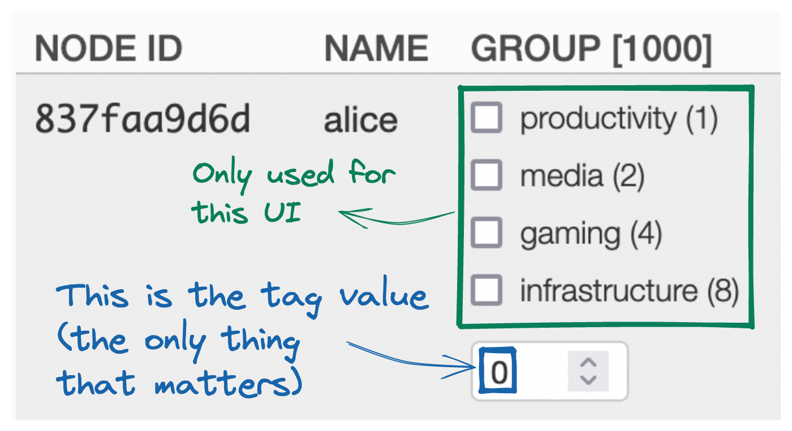
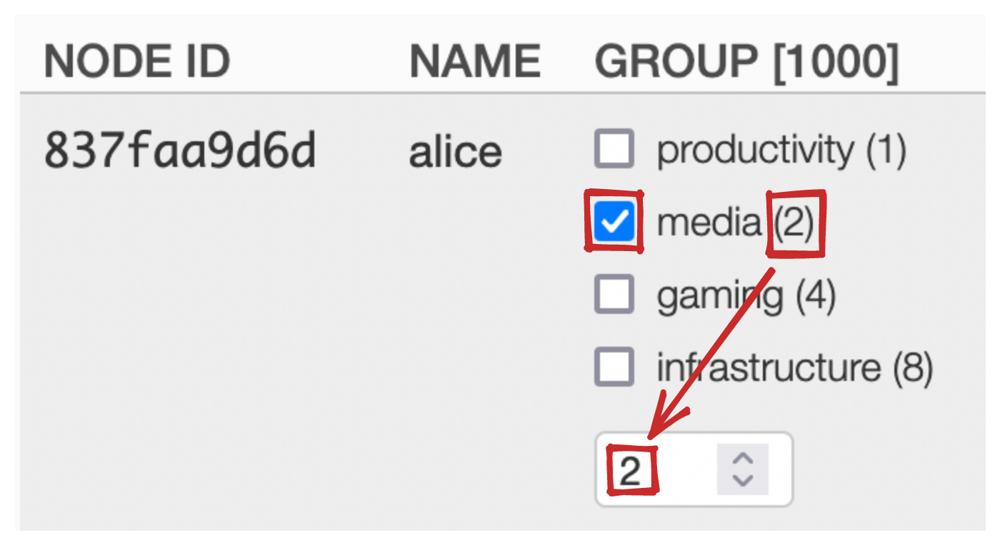
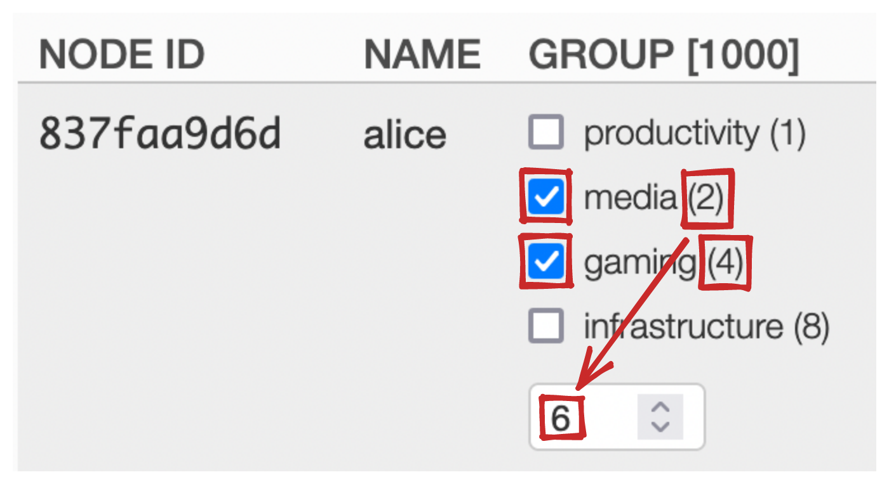
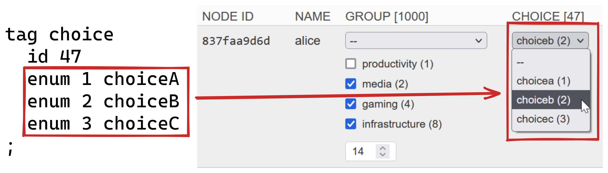
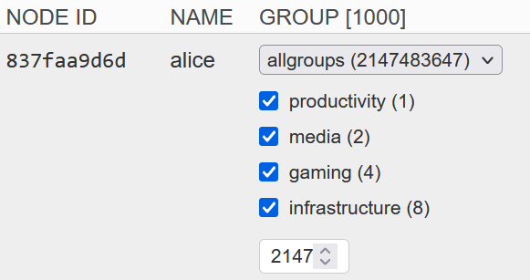

import zerotierRulesNetworkPartition from "./zerotier-rules-network-partition.excalidraw.svg";
import zerotierRulesMultipleNetworksExcalidraw from "./zerotier-rules-multiple-networks.excalidraw.svg";

An in-depth how-to on partitioning your ZeroTier network using rules.

## The Problem We're Solving

With ZeroTier the recommended way to partition nodes (that shouldn't talk to each other) is to put them on separate ZeroTier networks[^tailscale-comparison]. It would look like this:

<Image
  src={zerotierRulesNetworkPartition}
  data-invertible
  width="100%"
  height="100%"
  alt="No Rules - Separate Networks"
/>

This approach is foolproof because it doesn't require any rules, and is absolute in locking down all traffic (since different ZeroTier networks cannot communicate with each other).

It's possible to have one node on several networks. For example you can have a hub-and-spoke topology where one node talks to all other nodes, but all other nodes cannot talk to each other:

<Image
  src={zerotierRulesMultipleNetworksExcalidraw}
  data-invertible
  width="100%"
  height="100%"
  alt="No Rules - Multiple Networks On One node"
/>

There are two downsides to this approach:

1. Joining the network has to be done at the node's ZeroTier client, so you have to go back and forth between all your nodes and ZeroTier Central.
1. In the example above, every time you want to extend the network by adding a new node, you have to also create a new network. You have to join that network from both the new node and the hub of the network. That's really annoying and inflexible.

Using ZeroTier rules it is possible to have the same kind of topology with a single ZeroTier network that has the following properties:

- Instead of networks we'll have groups.
- Nodes can belong to multiple groups.
- Nodes that share a group will be able to talk to each.
- Nodes that share no common groups will _NOT_ be able to talk to each other.
- Management of all traffic will just be a matter of editing rules and group membership in ZeroTier Central. No editing at the clients is required.
- Everything will be zero-trust[^zero-trust]: new nodes will be isolated from the network until you grant them group membership.

## Prerequisites

- A ZeroTier network, w/ access on ZeroTier Central
- Several client nodes joined to the network
- A basic understanding of [ZeroTier's Rule Engine](https://docs.zerotier.com/zerotier/rules)

## Understanding Tags and the ZeroTier Central Rule Editor

### Defining a Tag

In [ZeroTier Central](https://my.zerotier.com) you'll see a section called "Flow Rules." On the left you see the rules in ZeroTier's Domain Specific Language and on the right you see a preview of the JSON representation (which you can ignore):



At the time of writing the default rules are:

```
#
# Allow only IPv4, IPv4 ARP, and IPv6 Ethernet frames.
#
drop
	not ethertype ipv4
	and not ethertype arp
	and not ethertype ipv6
;

# Accept anything else. This is required since default is 'drop'.
accept;
```

Erase everything and start with a blank text area[^version-control]. We'll start by defining a group tag:

```
# Create a tag for group membership
tag group
  id 1000 # All tags must have a unique id.
  default 0 # Default = No group membership. Zero trust.

  # These flags are what you edit. The names can be anything.
  flag 0 productivity
  flag 1 media
  flag 2 gaming
  flag 3 infrastructure
;
```

Tags are 32-bit unsigned integers associated to your node (or, according to [the docs](https://docs.zerotier.com/zerotier/rules#33tagsaname3_3a), "32-bit numeric key-value pair credentials"). Everything above helps ZeroTier Central render a GUI for editing the value. For example, with the rules above we get this in ZeroTier Central's Tags Matrix:



And this flag editor which you can see by clicking the wrench icon next to any node in the `Members` section:



You can use any `id` you want as long as it is unique across all tags in your rules.

The `id` and `default` lines are relevant to the rules engine but `flag` and `enum` fields are actually invisible to the rules engine and only serve to help render the GUI editor for the fields. In the end, each node gets an integer value for the `group` tag:



Now when you check a flag, the tag value will change:



And if you check TWO flags, the tag value will capture that:



The tag value is conceptually NOT `2 + 4 = 6` but rather a bitwise OR: `2 | 4 = 6`. What does that mean? Well, we take the decimal values of the flags and [convert to binary](https://www.google.com/search?q=2+in+binary):

```binary
 ┌───────┐
 │0|0|1|0│ 2 (media)
 └───────┘
 ┌───────┐
 │0|1|0|0│ 4 (productivity)
 └───────┘
```

Then line up the columns. Any column that has a `1` in it in _either_ position keeps the `1`. Every other column is a `0`:

```binary
 ┌─┬─┬─┬─┐
 │0│0│1│0│ 2 (media)
 │0│1│0│0│ 4 (productivity)
 └─┴─┴─┴─┘
  ▼ ▼ ▼ ▼  2 | 4
 ┌─┬─┬─┬─┐
 │0│1│1│0│ 6
 └─┴─┴─┴─┘
```

[`0110` in decimal is `6`](https://www.google.com/search?q=0b0110+in+decimal), which is our tag value. This is called a bitwise OR.

It just so happens that ADDing bit flag values produces the same result as ORing them, but we need to get in the bitwise operation mindset for later.

## Rule Setup for Groups

The `flag` lines are what you will edit. Each flag represents one group. When adding a group make sure you increment the flag value (e.g. we would use `flag 4 <group-name>` to add a group to the rules above). With my setup you are limited to 31 flags (ZeroTier's rule engine limits you to 32 flags, normally[^why-u31]). So `flag 30` is the highest value you should use (flags are 0-indexed):

```
flag 0 productivity
flag 1 media
flag 2 gaming
flag 3 infrastructure
flag 4 security
...
flag 30 highestFlagYouCanUse
```

Next we can leave the default `drop` rule:

```
#
# Allow only IPv4, IPv4 ARP, and IPv6 Ethernet frames.
#
drop
  not ethertype ipv4
  and not ethertype arp
  and not ethertype ipv6
;
```

Next we create the rule that does the magic:

```
# Drop any traffic between nodes that don't share at least one group
break
  tand group 0
;
```

This looks up the value for the `group` tag for each side of the traffic (sender and receiver) and bitwise ANDs them together. If the resulting value is `0`, which will only happen when the sender and receiver share no groups, we break.

`break` is defined as:

> Terminate evaluation of this rule set but continue evaluating capabilities.

It's like `drop` but can be overridden by a capability.

`tand` is defined as:

> Tags ANDed together equal value

An AND operation is like the OR we did above, except that we only keep `1` when _both_ values in the column are `1`. For example, if Alice is in the `media` and `gaming` groups and Bob is in the `productivity` group:

```binary
 ┌─┬─┬─┬─┐
 │0│1│1│0│ Alice = 6 (media | gaming)
 │0│0│0│1│ Bob = 1 (productivity)
 └─┴─┴─┴─┘
  ▼ ▼ ▼ ▼  6 & 1
 ┌─┬─┬─┬─┐
 │0│0│0│0│ 0
 └─┴─┴─┴─┘
```

The result of `6 & 1 = 0` would cause us to break and block the traffic. But if we add Bob to the `media` group:

```binary
 ┌─┬─┬─┬─┐
 │0│1│1│0│ Alice = 6 (media | gaming)
 │0│0│1│1│ Bob = 3 (media | productivity)
 └─┴─┴─┴─┘
  ▼ ▼ ▼ ▼  6 & 3
 ┌─┬─┬─┬─┐
 │0│0│1│0│ 2
 └─┴─┴─┴─┘
```

The result of `6 & 3 = 2` does NOT break. Instead we flow into our last rule: an unconditional accept.

```
# default to accept
accept;
```

Putting that altogether, our rules should now read:

```
# Create a tag for group membership
tag group
  id 1000 # All tags must have a unique id.
  default 0 # Default = No group membership. Zero trust.

  # These flags are what you edit
  flag 0 productivity
  flag 1 media
  flag 2 gaming
  flag 3 infrastructure
;

#
# Allow only IPv4, IPv4 ARP, and IPv6 Ethernet frames.
#
drop
  not ethertype ipv4
  and not ethertype arp
  and not ethertype ipv6
;

# Drop any traffic between nodes that don't share at least one group
break
  tand group 0
;

# default to accept
accept;
```

### "All Group" Nodes

If you want a node to belong to all groups, we _could_ just check all the group flags we've defined. That would work... for now. But if you add a flag you have to remember to go through all the all-group nodes and check the new flag you added. An `allgroups` enum solves this.

`enum`, unlike `flag`, gives you a dropdown to choose from:



Any enum value that is selected will totally overwrite any flags that are checked. The result is that we can create an enum dropdown value that means "all flags I could possibly define." In bitwise logic speak that would be:

```
all group flags = flag 0 | flag 1 | flag 2 | flag 3 | flag 4 | ... | flag 30
```

Which is:

```binary
┌────────────────────────────────────────────┐
│00000000000000000000000000000000000000000001│
│00000000000000000000000000000000000000000010│
│00000000000000000000000000000000000000000100│
│00000000000000000000000000000000000000001000│
│00000000000000000000000000000000000000010000│
│                    ...                     │
│00001000000000000000000000000000000000000000│
│00010000000000000000000000000000000000000000│
│00100000000000000000000000000000000000000000│
│01000000000000000000000000000000000000000000│
│10000000000000000000000000000000000000000000│
└────────────────────────────────────────────┘
 ▼▼▼▼▼▼▼▼▼▼▼▼▼▼▼▼▼▼▼▼▼▼▼▼▼▼▼▼▼▼▼▼▼▼▼▼▼▼▼▼▼▼▼▼
┌────────────────────────────────────────────┐
│11111111111111111111111111111111111111111111│
└────────────────────────────────────────────┘
```

That large number is `2^31` or `2,147,483,648` so we use that as our enum value. If selected, it would equivalent to selecting all possible flag values. So we add the enum:

```
# Create a tag for group membership
tag group
  id 1000 # All tags must have a unique id.
  default 0 # Default = No group membership. Zero trust.

  # These flags are what you edit
  flag 0 productivity
  flag 1 media
  flag 2 gaming
  flag 3 infrastructure

  # This special value means "access to all groups"
  enum 2147483647 allgroups # <=========================== add this
;
```

And the UI for making an all-groups node looks like this:



Now, even if new flags are added in the future, Alice will continue to be able to communicate with any group.

#### An Alternative: Capabilities

I prefer my `allgroups` enum for its simplicity but an alternative would be to create a [superuser capability](https://docs.zerotier.com/zerotier/rules#32capabilitiesaname3_2a). You would add a capability like so:

```
# Create a capability called "superuser" that lets its holders override all but "drop"
cap superuser
  id 1000 # arbitrary, but must be unique
  accept; # allow with no match conditions means allow anything and everything
;
```

Capabilities override `break` rules but NOT `drop` rules, so you'd have to pay attention to that when crafting and placing any drop rule. Our group rule used `break` already so it is ready to be overridden by such a capability.

One difference between this `superuser` capability and the `allgroups` enum is that the enum still doesn't let a node communicate with nodes that have NO group memberships at all. The enum _just_ makes a node belong to all groups, while this capability would allow a superuser to bypass the group break rule entirely. For my arrangement I actually prefer to treat no-group nodes as completely isolated, but feel free to use the capability instead if it suits your setup better.

## Final Rules

```
# Create a tag for group membership
tag group
  id 1000 # All tags must have a unique id.
  default 0 # Default = No group membership. Zero trust.

  # These flags are what you edit
  flag 0 productivity
  flag 1 media
  flag 2 gaming
  flag 3 infrastructure

  # This special value means "access to all groups"
  enum 2147483647 allgroups
;

#
# Allow only IPv4, IPv4 ARP, and IPv6 Ethernet frames.
#
drop
  not ethertype ipv4
  and not ethertype arp
  and not ethertype ipv6
;

# Drop any traffic between computers that don't share at least one group
break
  tand group 0
;

# default to accept
accept;
```

[^tailscale-comparison]: This is in stark contrast to Tailscale where you can only connect to one network with one account and then everything has to be managed with ACLs. Tailscale's approach has its upsides (e.g. ACLs are _way_ easier than ZeroTier rules) and it's downsides (e.g. you can't use work and personal Tailscale accounts on the same node, ACLs can't cross organizations, etc).
[^zero-trust]: https://en.wikipedia.org/wiki/Zero_trust_security_model
[^version-control]: I recommend editing your rules in a version-controlled repository elsewhere and pasting it into the ZeroTier Central UI to make changes. This gives you a backup of your rules in addition to the versioning.
[^why-u31]: You might be wondering: "why use 2^31 instead of 2^32 since the latter would allow us to have 32 flags instead of 31?" The answer to that is simple: ZeroNS cannot parse enum values greater than the max 32-bit integer value because it cannot understand that enum values are UNSIGNED integers: https://github.com/zerotier/zeronsd/issues/126. By dropping the enum value to `2^31` we gain ZeroNS compatibility.
